# LM Warden

**Your own OpenAI-compatible LLM API on NVIDIA GPUs you already own: vLLM and
llama.cpp behind one port, a key per consumer with its usage, and a live view
of what the cards are doing.**

> Formerly LLM Warden and, before that, vLLM Warden. Existing installs upgrade
> in place ([how](documents/OPERATING.md#day-to-day)); the install directory
> (`/opt/vllm-warden`) and the key prefixes (`vw_`, `vwa_`) keep the old name.
> Website: [lmwarden.com](https://lmwarden.com).

[](LICENSE)
[](#two-engines-and-the-model-that-made-us-add-the-second)
[](documents/INSTALL.md)

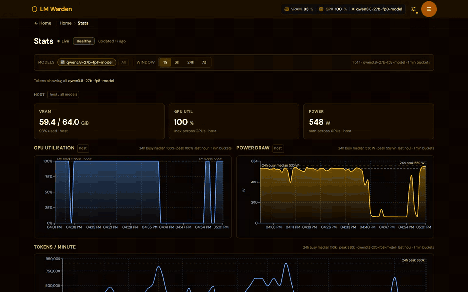

**Install it** on a Linux x86_64 host with Docker, an NVIDIA GPU and the NVIDIA
Container Toolkit:

```bash
curl -fsSL https://raw.githubusercontent.com/Podwarden/lm-warden/main/install.sh | sh -s -- --dir /opt/vllm-warden
```

Open `http://YOUR-HOST:8080/ui/`, finish the first-run wizard, add a model.
Your endpoint is `http://YOUR-HOST:8080/v1`: in any OpenAI client, only the
`base_url` and the key change. The clone route, every flag and the offline
install are under [Quick start](#quick-start) and in
[documents/INSTALL.md](documents/INSTALL.md).

You have NVIDIA GPUs: in a rack, in a workstation, or two cards bought eighteen
months apart in a box under a desk. You want what is on them reachable the way
a hosted API is reachable: a base URL, a key, and a client library that already
exists. You also want what a hosted API gives you as a matter of course and a
bare engine does not: a separate key per consumer, usage attributed to it, and
a straight answer about what the hardware is doing. What you have instead is
one container per model, a `--tensor-parallel-size` you arrived at by
bisection, and `nvidia-smi` open in a second terminal to find out why a request
is slow.

LM Warden is the control plane around the engines. Pull a model from Hugging
Face, load it, mint a key, open that key's page to see what it spent and how
long its requests waited, and watch what the card is doing. One published port,
so your own TLS terminator, ingress, SSO or network policy sits in front of it
unchanged. The engines are upstream and unmodified; that is a hard rule, and
[the second engine exists because of it](#two-engines-and-the-model-that-made-us-add-the-second).
Nothing reports home: no account, no licence check, no analytics, and an
[offline install](documents/INSTALL.md#a7-offline--air-gapped-install) for
hosts with no route out.

If you run Claude Code or another coding agent, the warden can also answer the
Claude model names you choose on your own GPUs, pass the rest to Anthropic on
your own login, and keep each conversation on the replica that already holds
its cache. That part is
[measured below](#claude-code-and-coding-agents-on-your-gpus).

---

## What it is, and what it is not

It is a wrapper, and that is the whole claim. It does not make models faster,
it does not fork an engine, and it will not do anything to your tokens that
`vllm serve` would not. What it adds is the part nobody ships: model
lifecycle, per-key auth with usage accounting, and an honest view of the GPU.

**The shape of it.** Three containers behind one Caddy front door on a single
published port; JWT sessions with CSRF on the control plane and bearer tokens
on `/v1/*`; a SQLite store with numbered migrations; an engine watchdog that
probes `/health` rather than trusting the process tree; `mypy --strict`
against a committed baseline, and a pytest suite that runs in a container.
`make lint`, `make typecheck`, `make test`: all three on a clean checkout, no
host Python. The layout, the two engine drivers and what each one does and
does not isolate are in
[documents/ARCHITECTURE.md](documents/ARCHITECTURE.md).

**What is automatic, and what is not.** A dead engine under a live wrapper is
detected, its evidence is captured and the model is reloaded without you. The
wall-clock request reaper is **off by default**, and a GPU is claimed by one
model until you unload it. Why each of those is the way it is:
[What is automatic, and what is not](documents/ARCHITECTURE.md#what-is-automatic-and-what-is-not).

**Leaving is a `base_url` change.** Apache-2.0, OpenAI-compatible on the way
in, the weights in an ordinary Hugging Face cache volume you can export as a
tarball, and the exact argv each engine was launched with one GET away:
[Leaving](documents/ARCHITECTURE.md#leaving-is-a-base_url-change).

**Walked end to end.** Install, wizard, key, register, pull, load and a real
completion were run from the published release on a host it had not been
developed on, following only what was written down.
[documents/INSTALL.md](documents/INSTALL.md) is that walk, recorded in full:
every command run, every block of output as the terminal printed it. The four
things the documentation did not say then have sections of their own now:
[a first run with no browser](documents/API.md#first-run-without-a-browser),
[pull and load are separate asynchronous steps](documents/API.md#adding-a-model-from-the-api),
[a GPU serves one loaded model at a time](documents/HAZARDS.md#one-loaded-model-per-gpu),
and [`gpu_memory_utilization` is a fraction of the whole card](documents/HAZARDS.md#gpu_memory_utilization-reserves-a-fraction-of-the-whole-card).

## Will it run on my hardware?

NVIDIA only: no ROCm, no Metal, no CPU serving path. vLLM's own support matrix
applies unchanged, because it is upstream's image. **The floor is Turing
(sm_75, the RTX 20-series generation)**: the base image ships CUDA 13, which
dropped Maxwell, Pascal and Volta, so a GTX 1080 Ti, a Titan X or a V100 will
not work here and no rebuild changes that. Above that floor the llama.cpp
binary in the api image carries native code for every architecture CUDA 13
can target (Turing through Blackwell, including Ada, Hopper and the RTX
50-series) plus PTX, so a card newer than this release compiles on first load
instead of finding no backend at all. Narrowing the list to your own cards is a
build argument and makes the build much shorter:
[build from source](.github/CONTRIBUTING.md#build-from-source). FP8 weights on
Ampere are numerically broken upstream, not slow: the model loads, streams
tokens and emits garbage. The product warns about that rather than letting you
discover it.

Above the floor, the question is what fits. Measured on 16 GiB cards against
vLLM 0.20.0 (this release ships 0.26.0; the rules have held across the
upgrades, the exact numbers are worth rechecking),
[What fits on what](documents/HAZARDS.md#what-fits-on-what) says which model
classes run on one card, which need two, and which quantisations to avoid; the
rest of [documents/HAZARDS.md](documents/HAZARDS.md) is what to know before
the first load.

**Other GPUs are on the roadmap.** Apple silicon (Macs), AMD Radeon and Intel
GPUs are on our immediate roadmap, with no dates; which comes first depends on
who asks. Tell us which one you would run it on, in the Ideas category of the
project's GitHub Discussions:
[Mac](https://github.com/Podwarden/lm-warden/discussions/new?category=ideas&title=Hardware%20support%3A%20Mac),
[AMD Radeon](https://github.com/Podwarden/lm-warden/discussions/new?category=ideas&title=Hardware%20support%3A%20Radeon),
[Intel](https://github.com/Podwarden/lm-warden/discussions/new?category=ideas&title=Hardware%20support%3A%20Intel).

### Don't use this if

None of these are solvable by configuration today.

- **You have no NVIDIA GPU.** `--gpus none` starts the control plane for
  evaluation and CI; nothing can be loaded on it.
- **You need to serve one model across several machines.** This is a
  single-host Compose stack. Multiple GPUs in one box, yes; multi-node, no.
- **You want a hosted API.** Nobody operates this for you. You supply the
  hardware, the driver, the disk and the electricity.
- **You need a backend that is not vLLM or llama.cpp** (TensorRT-LLM, SGLang,
  MLX, Ollama's runtime). The seam to add one is real and small, but nothing
  else ships today.
- **You want several models resident on one card.** One loaded model per GPU
  is an ownership rule enforced before an engine starts.
- **You want tensor parallelism out of llama.cpp.** It splits layers, not
  tensors. For a model too large for one card, vLLM is still the right answer.
- **Your host is not Linux x86_64.** The api image is built on upstream's CUDA
  base and needs both.

---

## Quick start

A Linux host with Docker, Docker Compose v2.24+ (v5.x is fine), an NVIDIA GPU,
the NVIDIA Container Toolkit, and 40 GB free where Docker keeps its images.

From a clone:

```bash
git clone https://github.com/Podwarden/lm-warden.git
cd lm-warden
./install.sh
make smoke      # 200s across / /_landing /ui/ /api/csrf /healthz
```

Or without one: the one-liner at the top downloads the source tree into the
directory you name, then proceeds exactly as above. Any directory works; add
`--yes` for automation. [documents/INSTALL.md](documents/INSTALL.md) covers
both routes flag by flag, and the
[offline / air-gapped install](documents/INSTALL.md#a7-offline--air-gapped-install).

The installer checks the host, lets you pick GPUs, generates the secrets, pulls
the release images and offers to start the stack. Open
`http://YOUR-HOST:8080/ui/`; a first-run wizard covers GPU selection, a Hugging
Face token and your admin account. Then **Models → Add model**. Your
OpenAI-compatible endpoint is live at:

```
http://YOUR-HOST:8080/v1/chat/completions
```

Point any OpenAI client at it: LangChain, OpenWebUI, the `openai` SDK, your
agents. Only the `base_url` and the key change.

> **Upgrading an install from before the rename to `lm-warden`?** Keep its
> existing directory and `.env` (which pins `COMPOSE_PROJECT_NAME=vllm-warden`,
> the name your volumes live under); a fresh clone into `lm-warden/` without
> that line would start on new, empty volumes. The old image names
> (`vllm-warden`, `llm-warden`) are still published until 2026-12-31. Details:
> [documents/OPERATING.md](documents/OPERATING.md#day-to-day).

Scripting the whole thing instead of clicking?
[First run without a browser](documents/API.md#first-run-without-a-browser) is
the six-call version, and
[Adding a model from the API](documents/API.md#adding-a-model-from-the-api) is
the rest. Stop, upgrade and the rest of the `make` targets:
[Day-to-day](documents/OPERATING.md#day-to-day).

---

## What you get

A bare engine is a single-model process. This is what sits around it, and once
the hardware is bought, a request costs electricity rather than a per-token
line on someone's invoice.

| A bare engine | With LM Warden |
|---|---|
| One model per container, restart to switch | Register, pull, load and unload from the browser |
| One engine, take it or leave it | vLLM **and** llama.cpp, chosen per model |
| A single shared API key, or none | A key per consumer, each with its own page, priority lane, pause switch and rotation grace window |
| No record of who used what | Requests, prompt tokens and completion tokens rolled up per key and per client IP, plus each key's queue wait and latency |
| No way to see what a client actually sent | God mode: an opt-in, in-memory live view of one key's prompts and completions, streaming only while open; off by default |
| A port per engine to expose | One published port; your own TLS terminator, ingress, SSO or network policy goes in front of it |
| `nvidia-smi` in a second terminal | Per-card VRAM, utilisation, power, temperature against the driver's own throttle point, PCIe width, ECC, NVLink |
| No idea why a request is slow | Live request table, TTFT and duration distributions from the proxy, KV-cache pressure and preemptions where the engine reports them |
| Hand-edited `--tensor-parallel-size` | Guided setup, a fit preview before you pull, and a stress test that measures the ceiling |
| A dead engine nobody notices | `/health` watchdog, evidence captured, model reloaded |

- **Browser UI**: models, live engine logs, chat playground, stats, and a page
  per API key.
- **OpenAI-compatible gateway** at `/v1/*`, a drop-in for any existing client.
  `GET /v1/models` reports `max_model_len`, so clients stop guessing the
  context window.
- **Claude Code and the Anthropic SDKs**: `POST /v1/messages` speaks the
  Anthropic Messages API, so `ANTHROPIC_BASE_URL` can point at a warden's root
  URL. With the router on, rules send the Claude model names you choose to
  your GPUs and pass the rest to Anthropic on your own login. See
  [below](#claude-code-and-coding-agents-on-your-gpus) and
  [documents/API.md](documents/API.md#claude-code-and-the-anthropic-messages-api).
- **Codex CLI**: `POST /v1/responses` speaks the OpenAI Responses API,
  translated to Chat Completions for your served model, with the same
  accounting, session column and replica affinity. Run live on 2026-10-05 with
  Codex 0.160; it is stateless and local only (router rules do not apply):
  [Codex CLI and the OpenAI Responses API](documents/API.md#codex-cli-and-the-openai-responses-api).
- **A setup page per client**: **Connect** fills in the setup for Claude Code,
  Codex CLI, OpenCode, Aider, Grok CLI, the Anthropic and OpenAI SDKs and
  three editors with this warden's address, a key and a loaded model, says
  what each tool gets, and sends a test request.
- **Model lifecycle**: pull from Hugging Face, hot-swap without restarting the
  container, per-model settings, GGUF on either engine, and a cache manager
  that lists what is on disk, garbage-collects orphans and exports or imports
  the whole cache as a tarball.
- **Per-key auth and accounting**: one token per consumer, each with its own
  priority lane, pause switch and rotation grace window. Requests and tokens
  are attributed to the key that spent them and to the IP that called. Each
  key's page charts tokens, requests, queue wait and latency (median and 95th
  percentile) over any period you drag or type, earlier keys included;
  `GET /api/tokens/{id}/series` returns the same series.
  [Managing API keys](documents/OPERATING.md#managing-api-keys).
- **Request-level visibility**: a live table of what is in flight (key, client
  IP, the client's session, model, context used against `max_model_len`, and
  the phase: queued, prefill, thinking, tool call, answering), with the
  estimated share of the prompt already in the replica's prefix cache and, for
  a slow prefill, the likely cause. Finished requests are persisted with TTFT,
  duration, how each one ended and the measured number of cached prompt
  tokens. All of it is metadata: the `request_history` table has no column
  that holds prompt or completion text.
  [Reading what is in flight](documents/OPERATING.md#reading-what-is-in-flight).
- **Prefix-cache hits, measured**: each finished request records how much of
  its prompt came from the cache (vLLM's `--enable-prompt-tokens-details`,
  llama.cpp's own timings). The Stats page splits prompt tokens per second
  into cached and computed and shows the cache-hit share for the last hour.
- **GPU observability**: per-card telemetry with engine process attribution,
  plus an interconnect graph read from `nvidia-smi topo -m`, so you can see
  whether two cards have a path to each other before splitting a model across
  them.
- **Runs with no route out**: three image tarballs plus an optional
  model-cache tarball are the entire transport, and `HF_HUB_OFFLINE=1` stops
  the stack contacting huggingface.co at all.

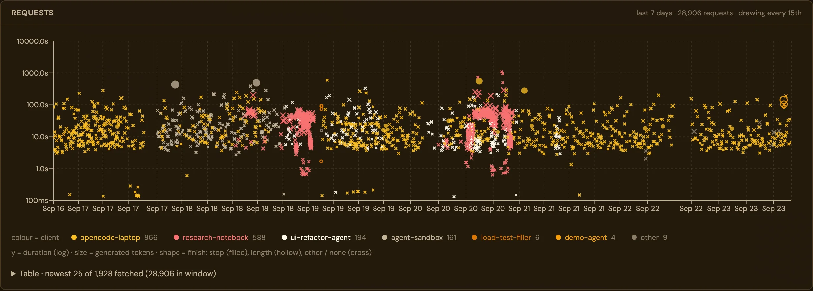

<table>
<tr>
<td width="50%">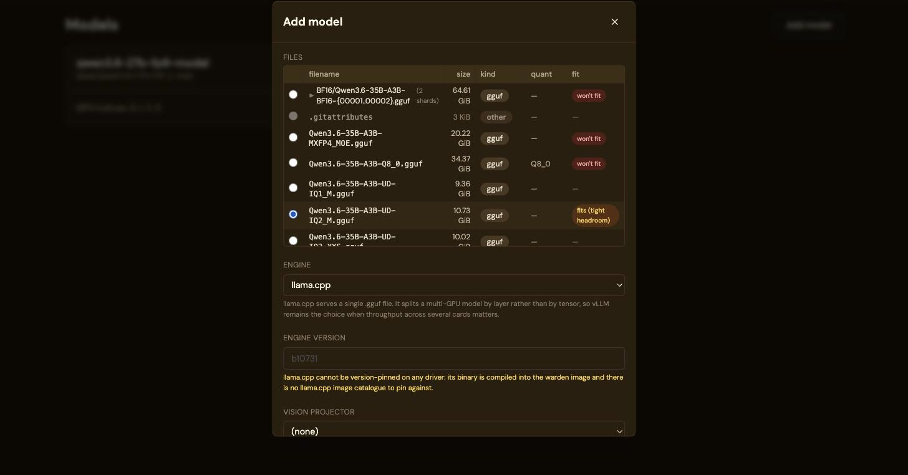<br>
<b>Pick the quant your hardware can actually run.</b> Point it at a repo and it lists
every file with a verdict: here a 35B where BF16, Q8_0 and MXFP4 are all too big
and <code>UD-IQ2_M</code> fits.</td>
<td width="50%">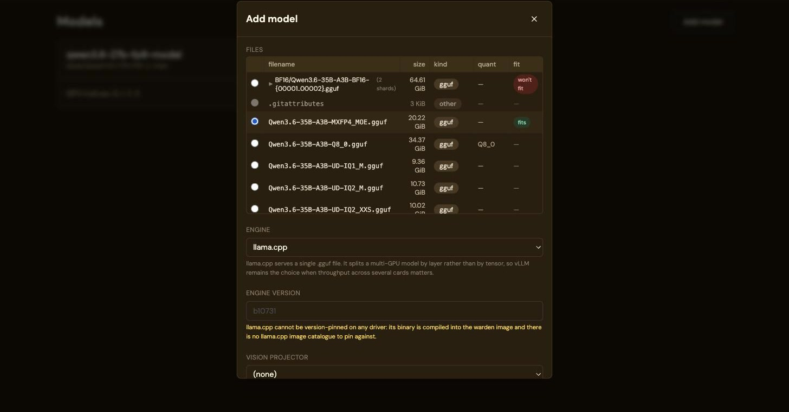<br>
<b>Tick more cards and the budget adds up.</b> The 20.22 GiB file that will not fit
on one 16 GiB card fits across four; the verdict recomputes as you select GPUs.</td>
</tr>
<tr>
<td>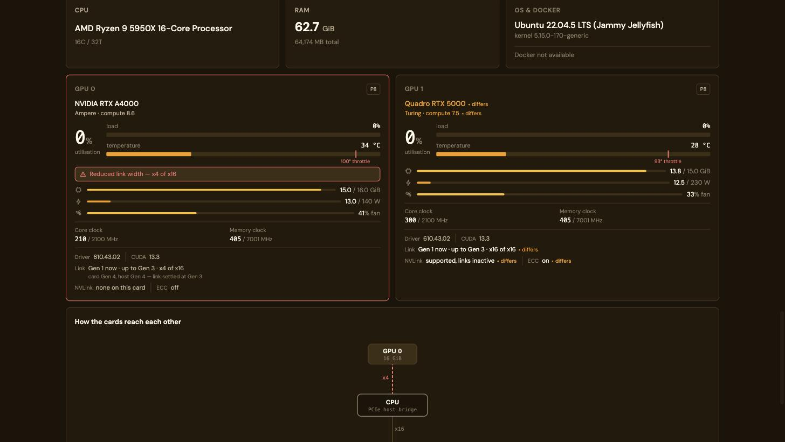<br>
<b>Mismatched cards, read honestly.</b> An Ampere A4000 beside a Turing Quadro:
architecture, VRAM, power cap and ECC all differ, and the reduced PCIe link width
is called out rather than buried.</td>
<td>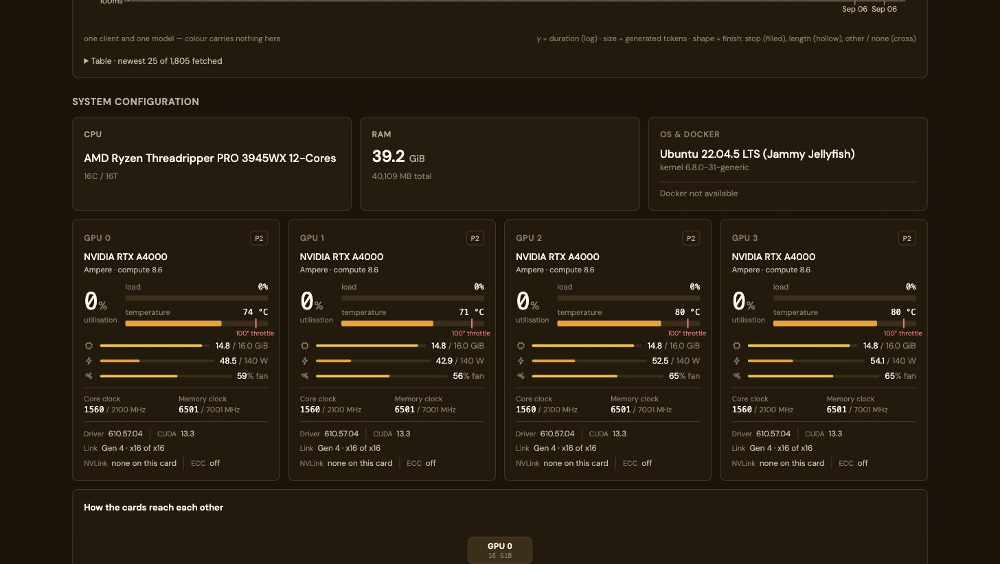<br>
<b>Per card, not per host.</b> Clocks, temperature, power, fan, driver and CUDA for
each card, with the throttle threshold marked on the temperature bar.</td>
</tr>
<tr>
<td>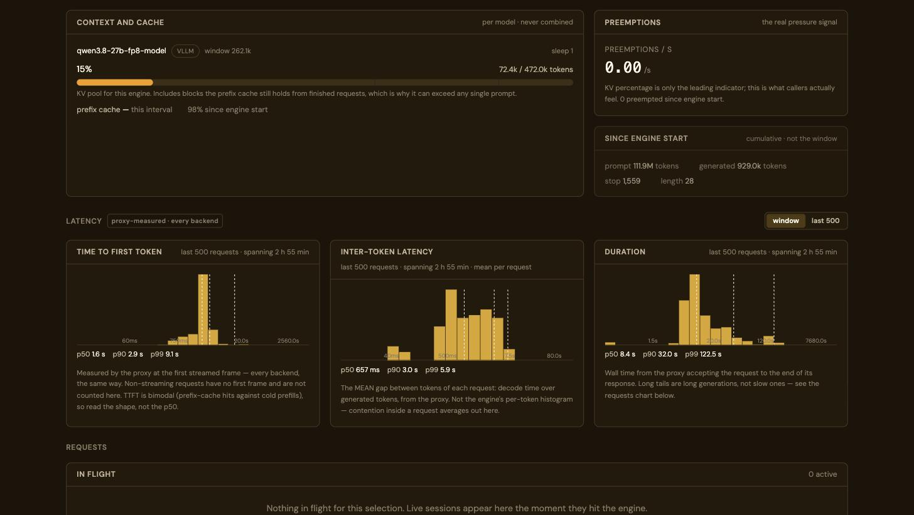<br>
<b>Latency measured at the proxy.</b> TTFT, inter-token and duration
distributions the same way for every backend, plus KV pool occupancy, prefix
cache hit rate and the preemption rate.</td>
<td>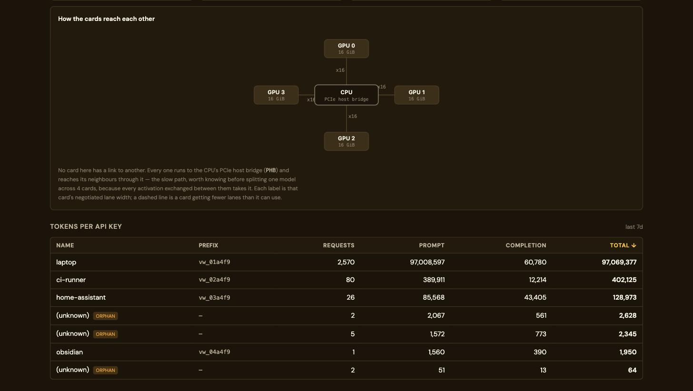<br>
<b>Server architecture.</b> The PCIe topology, with negotiated lane widths on
each edge, worth knowing before splitting a model. Below it, token usage per
API key.</td>
</tr>
<tr>
<td>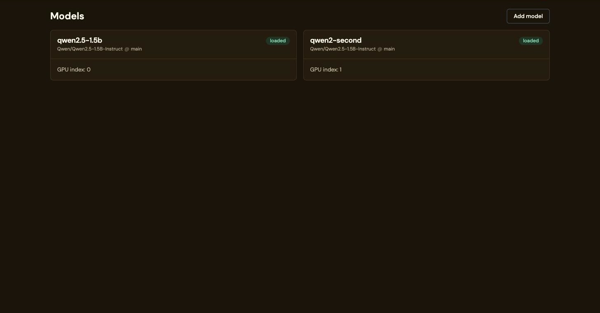<br>
<b>One loaded model per GPU.</b> Each model owns its card; the list shows which
index each one holds.</td>
<td>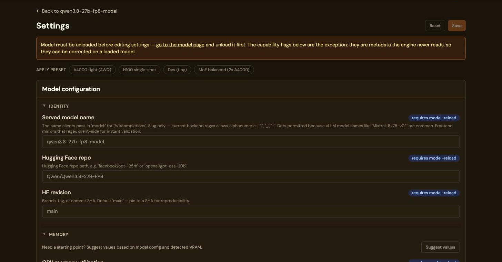<br>
<b>Starting points, not blank fields.</b> Presets for common card and model
shapes, and a suggestion pass driven by the model config and the VRAM actually
detected.</td>
</tr>
<tr>
<td>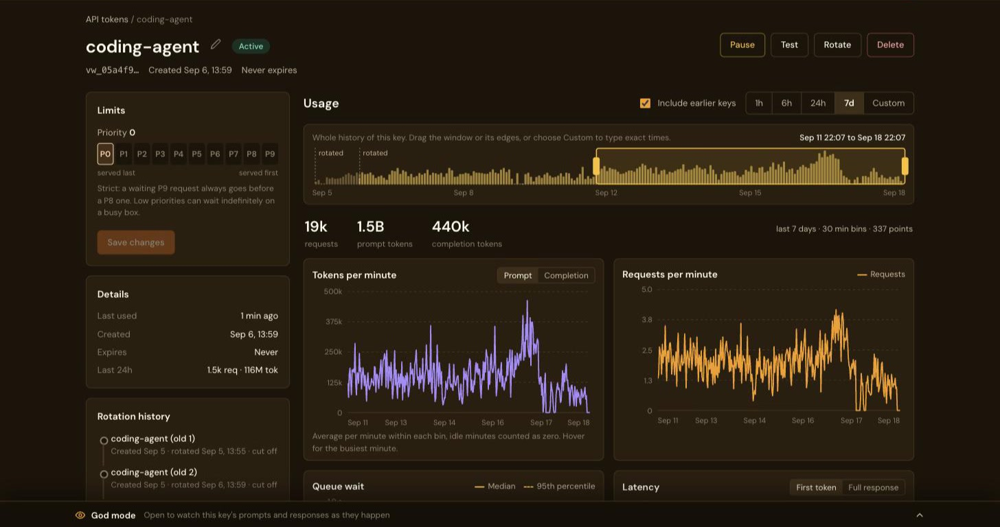<br>
<b>Every key has its own page.</b> Rename, pause, test, rotate or delete it and set
its priority. The history strip spans the key's whole life, earlier keys
included, with each rotation marked; drag the window to chart any period, or
type exact times.</td>
<td>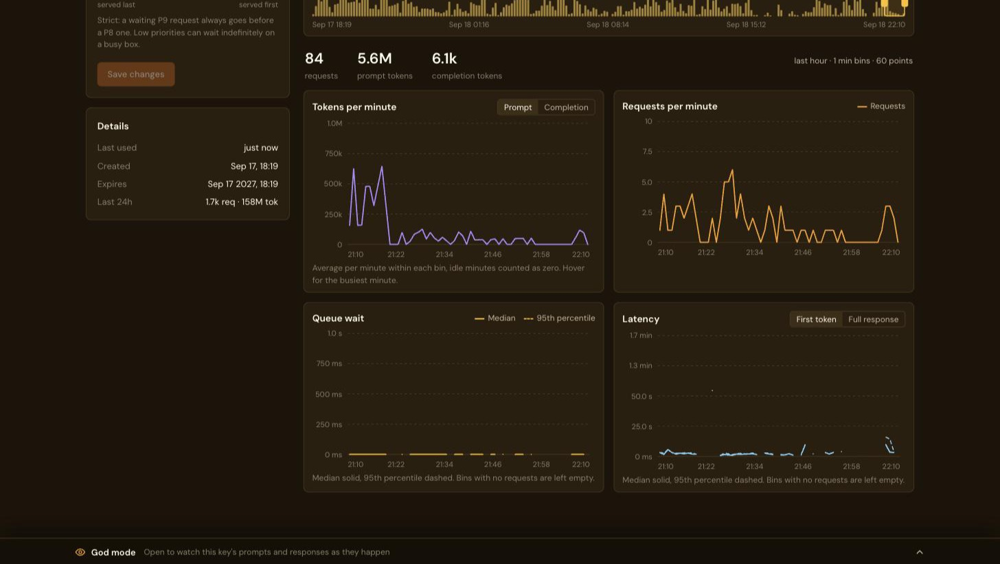<br>
<b>What one key waited for.</b> Queue wait and latency (first token or full
response) per key, median and 95th percentile, next to the tokens and requests
it sent. A bin with no requests is left empty rather than drawn as zero.</td>
</tr>
<tr>
<td>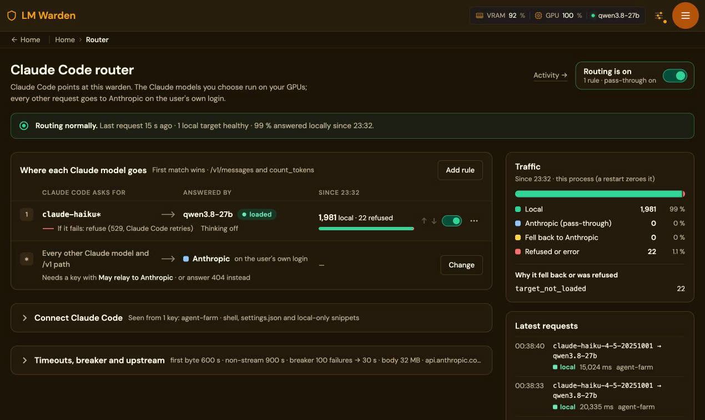<br>
<b>One rule per Claude model name.</b> First match wins; everything else is
passed to Anthropic on your own login. On the seven-GPU box below, a farm of
Claude Code agents had 1,981 <code>claude-haiku*</code> requests answered locally
by a 27B model (99 %); the other 22 were refused with a 529 while the model was
reloading (<code>target_not_loaded</code>). Recorded 5 October 2026.</td>
<td>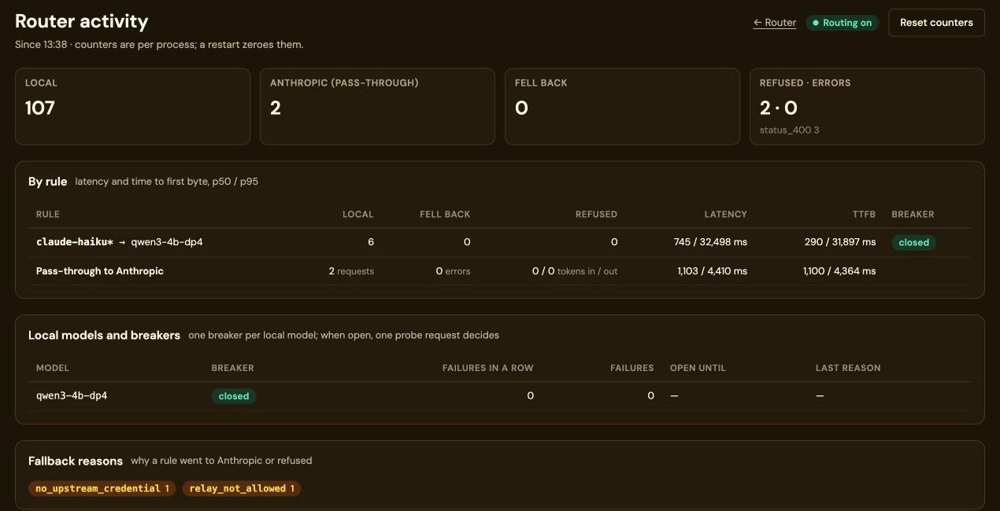<br>
<b>Every decision, with its reason.</b> Counters, latency per rule at p50 and
p95, the breaker per local model and why a rule went to Anthropic or refused.
Per process; a restart zeroes them. From the four-card test box, 4 October 2026.</td>
</tr>
<tr>
<td>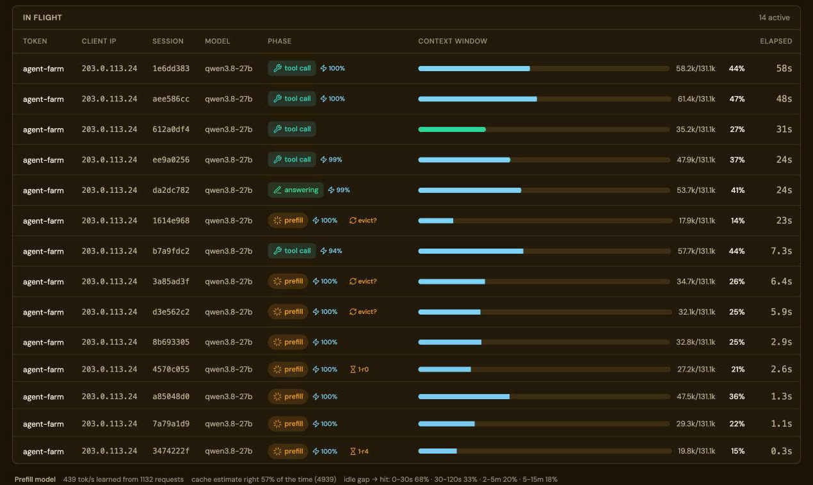<br>
<b>What each request is doing, and why it waits.</b> One row per request with
the client's session, its phase (queued, prefill, thinking, tool call,
answering) and badges: the estimated cached share of the prompt, and for a slow
prefill the likely cause (<code>1·r4</code>: one prompt ahead of it on replica 4;
<code>evict?</code>: its cache was probably evicted). Below, what the warden has
learned about this box: its prefill rate, how often the estimate was right, and
how the hit rate falls as a session sits idle.</td>
<td><br>
<b>Cached and computed, measured per request.</b> Prompt tokens per second
split into what the engine read from its prefix cache and what it had to
compute, with the cache-hit share for the last hour: 78 % here, on seven
replicas of a 27B model serving a farm of Claude Code agents. Minutes and
engines without a measurement are drawn as computed, never as cached.</td>
</tr>
<tr>
<td><br>
<b>The same console on a bigger box.</b> Seven 32 GiB cards, one 27B model as
seven replicas: 205.9 of 222.9 GiB of VRAM in use, the busiest card at 100 %,
2,037 W across the cards. The header readouts open this page, and the model chip
opens the model.</td>
<td>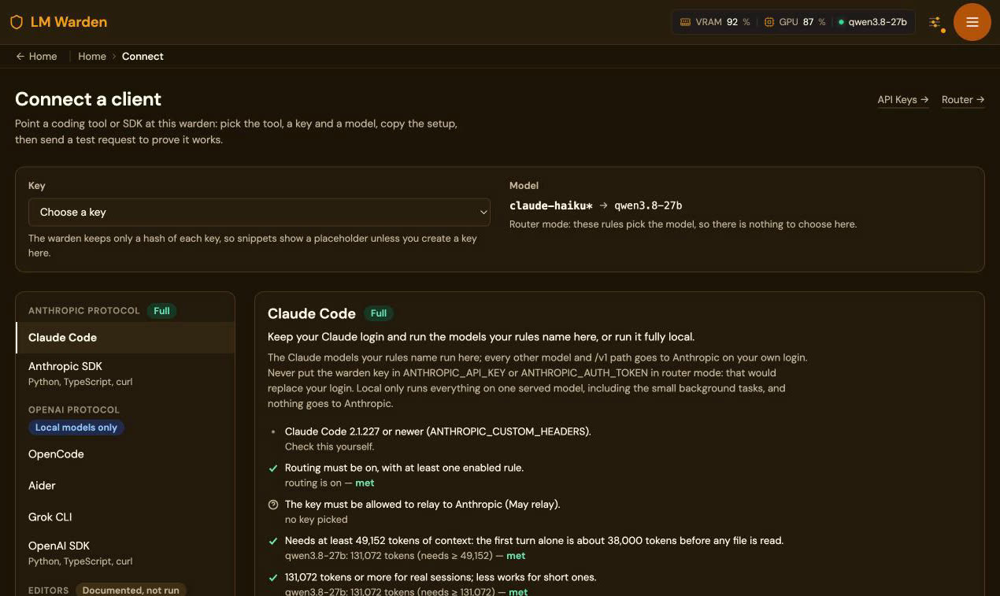<br>
<b>Setup for each client, checked against this warden.</b> Pick a tool, a key
and a model; the page writes the setup and checks the requirements it can see
(routing on, the key allowed to relay, enough context). A key is shown only when
you create it here, since the warden keeps only hashes.</td>
</tr>
<tr>
<td colspan="2">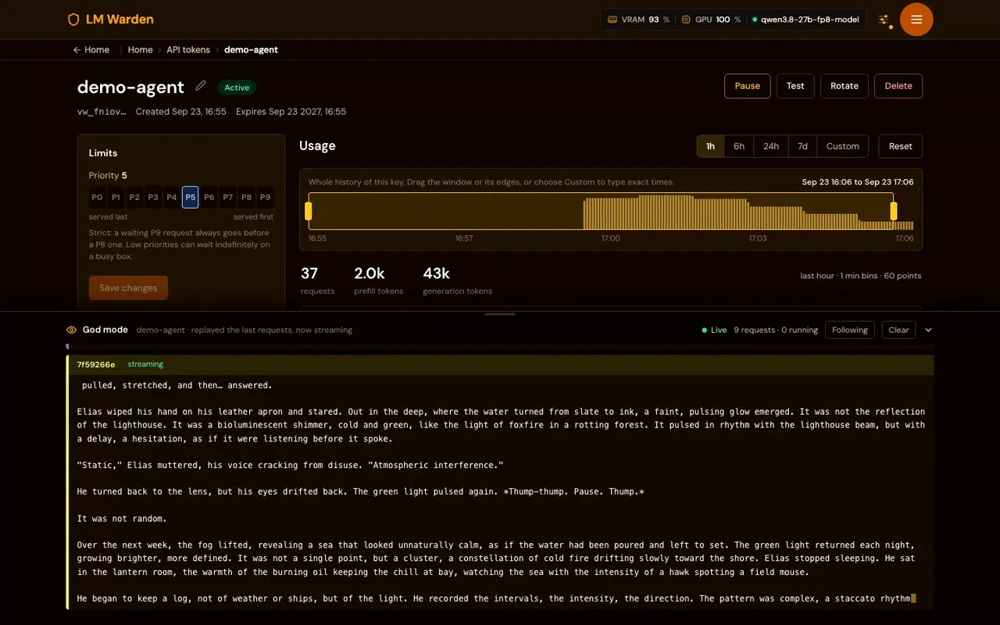<br>
<b>God mode, one key at a time.</b> Open the dock at the bottom of a key's page to
watch that key's prompts and responses as they happen, earlier keys included.
Close it and the stream stops; nothing is watched in the background. Off by
default (<code>VW_GODMODE_ENABLED</code>), and held only in memory.</td>
</tr>
</table>

---

## Claude Code and coding agents on your GPUs

**Why.** Every request Claude Code sends to Anthropic counts against your
plan's usage limits, or is billed per token on an API key, and takes its
prompt, your code included, off your machine. Many of those requests are small.
Answer them on cards you already own and they cost electricity, they do not
count toward your limits, and their prompts stay on your host.

**What actually happens.** Claude itself never runs here. Point Claude Code's
`ANTHROPIC_BASE_URL` at a warden, and a **rule** maps a model name Claude Code
asks for (`claude-haiku*`, say) to a model you loaded; that model answers in
Claude's place, under the name Claude Code asked for. Every other model (Opus,
if you leave it unmatched) and every other `/v1/*` path is passed through to
Anthropic byte for byte, streaming included, on your own login. The warden key
travels in its own header, so the login is never touched:

```bash
export ANTHROPIC_BASE_URL=https://warden.example
export ANTHROPIC_CUSTOM_HEADERS="X-LMWarden-Key: vw_…"
claude
```

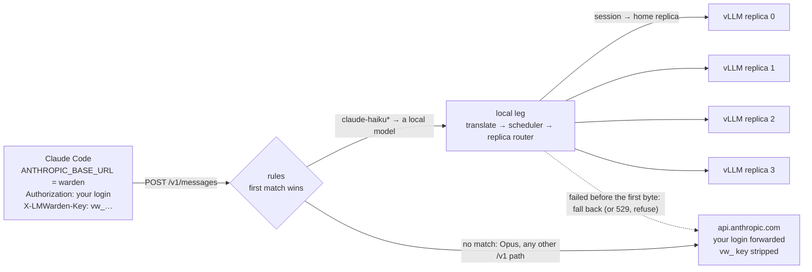

Three things make it usable rather than merely possible:

- **It fails toward Anthropic, not toward a hung terminal.** If the local model
  fails before the first byte (unloaded, engine error, timeout, a prompt longer
  than its context) the request goes to Anthropic; a rule can instead refuse
  with a 529, which Claude Code retries. A per-model breaker (after 3 failures
  in a row, nothing is sent to that model for 60 s) stops hammering a sick
  engine, and `/router/stats` shows every decision with its reason:
  [When the local leg fails](documents/ROUTING.md#when-the-local-leg-fails).
- **Local traffic lands on the replica that already holds its context.** An
  agent resends its whole history every turn, so the engine's prefix cache is
  what makes the next turn cheap. A model running as several replicas
  (`data_parallel_size`) has one cache per replica, and vLLM's own balancer
  sends each turn wherever the queue is shortest, usually to a replica that has
  never seen the conversation. The warden places a new conversation on the
  least-loaded replica, keeps it there for every later turn (keyed on the
  session id Claude Code already sends), and spills only above a per-replica
  threshold: [Replica routing](documents/ROUTING.md#replica-routing).
- **Not an open relay.** The router is off by default; a key must carry "May
  relay to Anthropic" before any request is forwarded; the warden key never
  reaches Anthropic and the Anthropic credential never reaches an engine;
  nothing from a passthrough is logged, stored or shown in god mode:
  [Router refusals](documents/ROUTING.md#router-refusals).

<picture>
  <source media="(prefers-color-scheme: dark)" srcset="assets/diagrams/replica-affinity-dark.svg">
  
</picture>

**Measured: vLLM's balancer against replica affinity.** Our four-card box
(4 × RTX A4000, 16 GiB each) running Qwen3-4B-Instruct-2507 in bf16 as four
one-card replicas on vLLM 0.26.0, 2026-10-04. The load is synthetic, shaped
like Claude Code's traffic (a shared 3.5k-token system prompt, a
session-unique first message of about 7.2k to 7.5k tokens, six turns of up to
256 tokens out, closed loop, three minutes per step), run once with vLLM's
balancer and once with affinity on, back to back. Each cell is balancer first,
affinity second.

| Concurrent sessions | Output tokens/min | TTFB p50 (s) | TTFB p95 (s) | Prompt tokens from cache (%) |
|---|---|---|---|---|
| 4 | 5,886 → 6,744 | 2.05 → 0.38 | 3.5 → 2.84 | 56.2 → 86.4 |
| 8 | 8,364 → 10,752 | 2.33 → 0.48 | 6.32 → 5.03 | 44.3 → 86.1 |
| 16 | 9,558 → 12,204 | 3.25 → 0.85 | 26.24 → 24.88 | 33.2 → 48.6 |
| 24 (overload) | 9,048 → 11,178 | 5.06 → 13.14 | 58.82 → 38.34 | 32.8 → 37.9 |
| 32 (overload) | 14,760 → 16,638 | 12.32 → 27.66 | 82.84 → 38.92 | 31.6 → 31.6 |

Up to 16 sessions, affinity is ahead on output, cache hits and both
time-to-first-byte columns, and the number of replicas doing work barely moved
(2.71 against 2.83 of four at 4 sessions): the gain is reuse of the cache, not
more cards working. At 24 and 32 sessions, a deliberate overload of four small
cards, output is still higher and the slow tail much shorter, but **the median
time to first byte is worse with affinity** (13.1 s against 5.1 s at 24
sessions). We have not isolated why, and lowering the spill threshold did not
change it; a box that runs at its limit should measure both settings, and
affinity can be switched off per model. One run per arm, so differences within
a second or two at 16 sessions are inside the noise. Time to first byte is
measured on the client, over the internet, to the first streamed token.

<picture>
  <source media="(prefers-color-scheme: dark)" srcset="assets/bench/c1-ttfb-dark.svg">
  
</picture>

Every number above, with the sessions-per-hour, replicas-busy and
stayed-on-replica columns and the full method, is in
[Measured: affinity off against on](documents/ROUTING.md#measured-affinity-off-against-on).
The raw figures are committed as
[`assets/bench/dp-affinity-ab.json`](assets/bench/dp-affinity-ab.json) and
[`scripts/bench-figures.py`](scripts/bench-figures.py) draws the charts and
tables from them; the load generator itself is ours and is not in this
repository. We have not measured answer quality, so whether a small model is
good enough for Claude Code's lighter work is judgement, not a benchmark; keep
Sonnet and Opus on Anthropic, which is what the catch-all does unless you add a
rule.

Two things to size for. A local model that serves Claude Code needs **well over
40k tokens of context**: its first turn in our session was 38,167 tokens, so
with a 32,768 context the engine refused it and the request fell back to
Anthropic; with 65,536 and an fp8 KV cache the 4B answered that cold first turn
locally in 28 s. And on a larger box (seven RTX 5090s, a 27B model as seven
replicas, a farm of headless agents) the cache-hit share fell from 81 % to
28 % in about 35 minutes once concurrent sessions times their context outgrew
the box's total KV cache; cutting concurrency to about two sessions per replica
and placing new sessions on the least-loaded replica brought it to 78 to 79 %
over the following hour. Both changes went in together, so that is an
observation, not an A/B:
[The same box since](documents/ROUTING.md#the-same-box-since).

Needs Claude Code 2.1.227 or newer; older clients keep working in local-only
mode. The counters on `/router/stats` and on a model's replica card are per
warden process, so a restart zeroes them. The whole mechanism, every refusal
reason, the failure table and a five-call setup are in
[documents/ROUTING.md](documents/ROUTING.md).

---

## Two engines, and the model that made us add the second

There is one product invariant, and everything below follows from it:

> **We ship mainline runtimes. No monkeypatching, ever.**

No patched engine image, no vendored fork, no `sh -c "patch && exec …"`
entrypoint, no `sitecustomize.py`, no `LD_PRELOAD`. A launch is argv plus
environment and nothing else. That is enforced by the type the launch path
speaks (it has no field to put a patch in) and by a test that fails if the
vocabulary reappears.

The invariant costs nothing to hold right up until a model you want will not load.
`ISTA-DASLab/Qwen3.8-27B-3Bit-GSQ` quantises the embedding table; mainline
vLLM's weight loader has no entry for it, and the model card's own remedy is a
newer vLLM plus a Python monkeypatch applied before the server starts. Under
the invariant that is not "hard", it is forbidden, so on vLLM this model stays
unsupported until upstream adds the format. The same authors publish a GGUF
conversion that runs unmodified in llama.cpp. Measured on one 16 GiB RTX
A4000, the IQ3_XXS quant with its vision projector holds `--ctx-size 8192` at
12,039 MiB of 16,376 MiB with no CPU offload, and passes a multi-turn chat,
arithmetic, format-compliance and image-description check through the
product's own `/v1/chat/completions`:
[the full measurement](documents/ARCHITECTURE.md#two-engines-and-the-model-that-made-us-add-the-second).

The claim is narrow: *a model the product genuinely could not serve is served,
unmodified, by a different mainline backend.* It is not that vLLM is bad. It is
that being locked to a single engine does not make the other models slower, it
makes them unavailable. Three consequences: GGUF quantisation fits larger
models onto smaller cards (a 27B on one 16 GiB card is a 3-bit quant's whole
point); older GPUs stay useful as vLLM's support moves on (Turing is off
vLLM's happy path, llama.cpp still serves it); and a box that grew an Ampere
card next to a Turing card is ordinary, and the stats page reads them as two
different cards rather than averaging them into a fiction.

**What the second engine costs.** llama.cpp publishes no latency histograms,
so the latency panels for every engine now come from the proxy's own
measurements (TTFT at the first streamed frame, duration at the end of the
stream), at the price of the engine's per-token resolution. A number an engine
does not report renders as **"not reported"**, never as `0`: on llama.cpp that
means KV-cache usage, sleep state, preemptions and MFU are blank rather than
reassuring. llama.cpp's version is fixed by the warden image (`b10731`); vLLM's
can be pinned per model under the Docker engine driver. A GGUF-only repository
ships no tokenizer, so token accounting falls back to a character estimate
until you set `tokenizer_repo`; the degradation is reported rather than hidden.
Pick a `.gguf` file in **Add model** and the wizard pre-selects llama.cpp. The
rest: [What the second engine costs](documents/ARCHITECTURE.md#what-the-second-engine-costs).

---

## Where data goes

**Nothing reports to us.** No account, no licence check, no analytics, no
callback: [`install.sh`](install.sh) and
[`docker-compose.yml`](docker-compose.yml) are the entire deployment and you
can read both. The stack makes outbound calls only when you ask it to:
huggingface.co to pull weights (`HF_HUB_OFFLINE=1` stops even that), Docker
Hub to list published vLLM tags when you open the engine-version picker, and
the release registry for the images, which `docker load` replaces entirely
([offline install](documents/INSTALL.md#a7-offline--air-gapped-install)). No
part of a request leaves the host unless you switch on the Claude Code router
and flag a key to relay, both off by default.

**No prompt or completion text is stored by default.** `request_history`, the
table behind the requests chart and the per-key rollups, has no column that
holds it. Two diagnostic features can capture content: god mode
(`VW_GODMODE_ENABLED`), an in-memory ring watched one key at a time from a
dock on that key's page, streaming only while the dock is open; and the
content log (`VW_CONTENT_LOG_ENABLED`), which writes to disk and only for
token ids on an explicit allowlist. Both are off by default, and with both off
the proxy's forward path is the code it would be in a build that never had
them. Their bounds, and what you must arrange yourself before switching the
second one on:
[Where request content can end up](documents/OPERATING.md#where-request-content-can-end-up).

---

## Where to go from here

Each of these is one hop from here and says what it holds.

- [documents/INSTALL.md](documents/INSTALL.md): the step-by-step install
  manual, recorded from two real installs: the published images (Path A), a
  build from source (Path B), the unattended flags, the no-clone one-liner,
  the offline / air-gapped install, what `make uninstall` does and does not
  free, and a symptom-to-cause table.
- [documents/API.md](documents/API.md): driving it without a browser: the
  six-call first run, minting and managing a key (rename, pause, rotation
  history, its usage and timing series, its god-mode stream), register / pull /
  load from the API, the Anthropic Messages and OpenAI Responses routes, and
  the admin API.
- [documents/HAZARDS.md](documents/HAZARDS.md): five things that cost an
  afternoon to diagnose and a paragraph to prevent: `/dev/shm` and tensor
  parallelism, one loaded model per GPU, what `gpu_memory_utilization` really
  reserves, what fits on a 16 GiB card, why first loads are slow, and how to
  measure `max_model_len` instead of bisecting it.
- [documents/OPERATING.md](documents/OPERATING.md): the day-to-day `make`
  targets, upgrading, the URLs once it is running, HTTP against HTTPS,
  managing API keys from their pages, reading the In-flight table and the
  cache-hit chart, which conversation a request belongs to (and the one-line
  setup for each harness), and where request content can end up.
- [documents/ROUTING.md](documents/ROUTING.md): one URL for Claude Code and
  which replica answers: what prompted it, how a request travels, rules and
  their precedence, the failure and refusal tables, replica placement,
  affinity and its tuning, and the A/B measurement in full.
- [documents/ARCHITECTURE.md](documents/ARCHITECTURE.md): one port and three
  containers, drivers against backends, what is automatic and what is not, and
  the full account of the two engines and what the second one costs.
- [.github/CONTRIBUTING.md](.github/CONTRIBUTING.md): building both images
  from source, how long that takes and how to make it shorter, the dev
  targets, and how to add a third backend.
- [CHANGELOG.md](CHANGELOG.md): every release, newest first.

## Contributing, security and licence

Bug reports, feature requests and pull requests are welcome on
[GitHub](https://github.com/Podwarden/lm-warden/issues). Building from source,
running the tests and the one rule a change cannot break are in
[.github/CONTRIBUTING.md](.github/CONTRIBUTING.md). Everyone taking part is
expected to follow the [Code of Conduct](CODE_OF_CONDUCT.md).

Please do not report a vulnerability in a public issue. Use GitHub's
[private vulnerability reporting](https://github.com/Podwarden/lm-warden/security/advisories/new)
instead; [SECURITY.md](SECURITY.md) says what to include and what happens next.

[Apache License 2.0](LICENSE). Third-party components and their licences are
listed in [NOTICE](NOTICE). vLLM is a project of the
[vLLM team](https://github.com/vllm-project/vllm); llama.cpp is a project of
[ggml.ai and its contributors](https://github.com/ggml-org/llama.cpp).
PodWarden is a trademark of its operators. LM Warden is not affiliated with or
endorsed by any of them.
