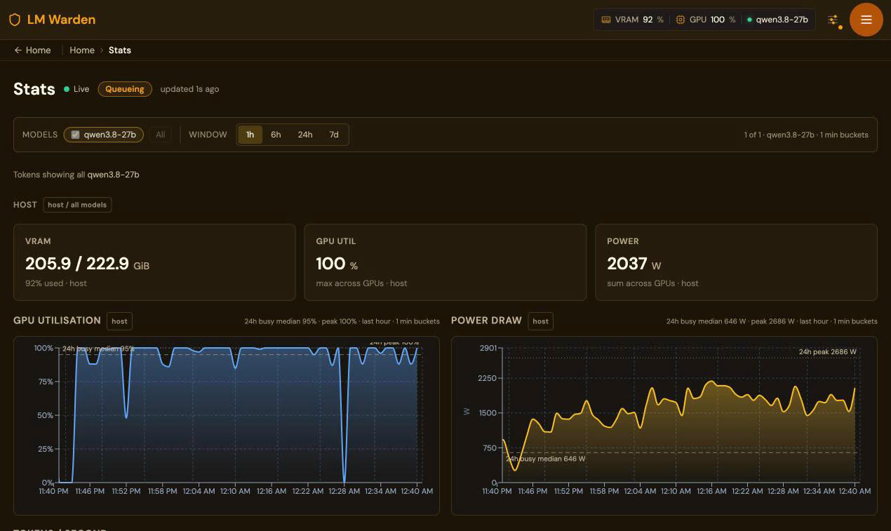
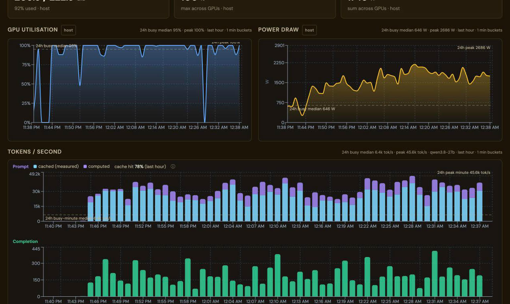
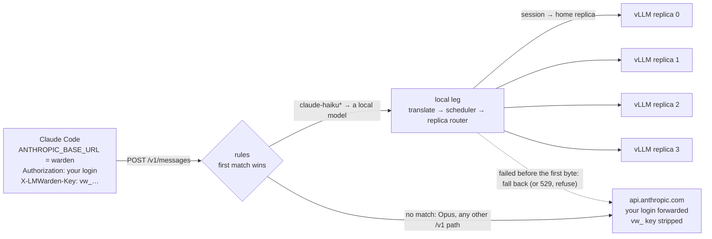
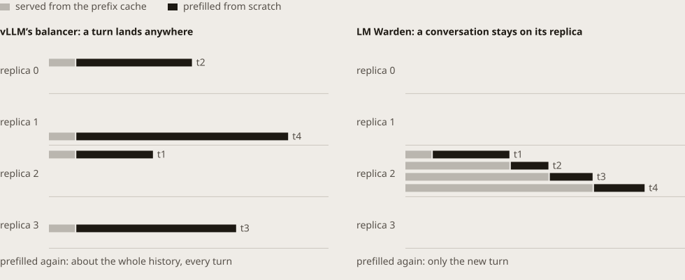
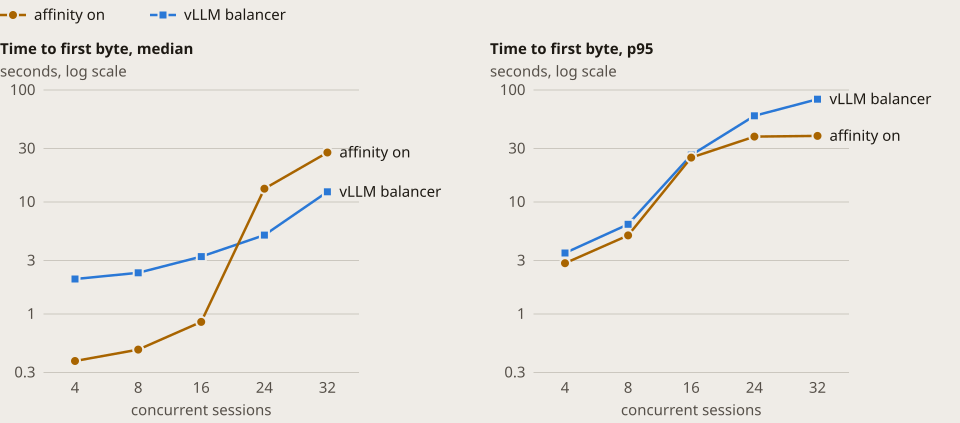
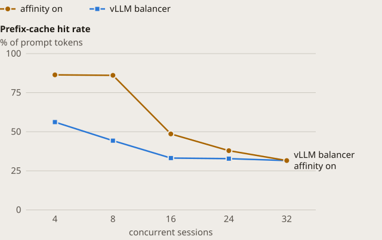
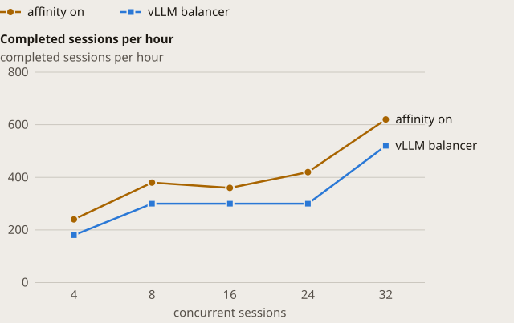
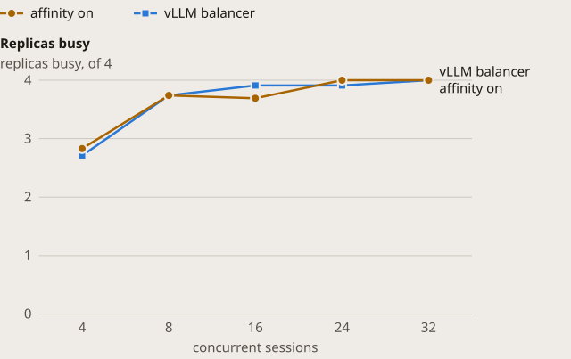
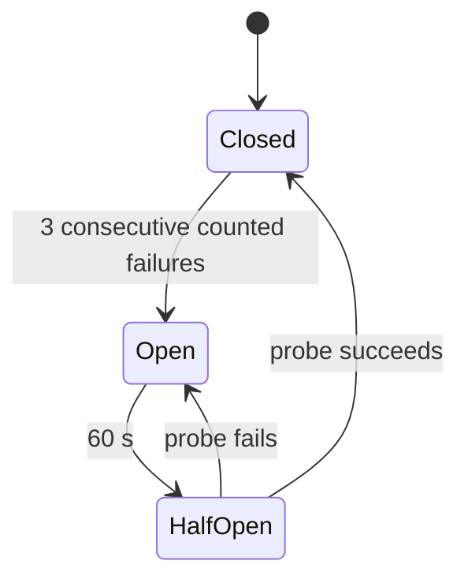

# Routing: one URL for Claude Code, and which replica answers

Two features share this page because they meet on one request. The first is the
**Claude Code model router**: Claude Code keeps its Anthropic login, and requests
for the Claude models you choose are answered by a model on your GPUs, under the
Claude name they asked for. Claude itself never runs locally. The point is cost,
usage limits and privacy: a request answered on hardware you own costs
electricity, does not count toward your Anthropic limits, and its prompt stays on
your host. The second is **replica routing**:
a model that runs as several vLLM replicas places each new conversation on its
least-loaded replica and keeps it there, so its prefix cache is used instead of
rebuilt. A request the router
answers locally goes through the replica router like any other.

- [The problem](#the-problem), [what prompted it](#what-prompted-it), and [the same box since](#the-same-box-since)
- [What changed](#what-changed)
- [How a request travels](#how-a-request-travels)
- [Why affinity beats balance for agents](#why-affinity-beats-balance-for-agents)
- [Measured: affinity off against on](#measured-affinity-off-against-on)
- [Reference](#reference): [data-parallel models](#data-parallel-models), [replica routing](#replica-routing),
  [the router](#the-router), [rules](#rules), [when the local leg fails](#when-the-local-leg-fails),
  [refusals](#router-refusals), [the catch-all](#everything-else-under-v1-the-catch-all),
  [settings and routes](#router-settings-and-routes), [stats](#stats), [tuning](#tuning)
- [Set up in five calls](#set-up-in-five-calls)

---

## The problem

An agent resends its whole history on every turn. A Claude Code conversation
that has been running for a while is a prompt of tens of thousands of tokens of
which only the last few hundred are new, so the engine's prefix cache is what
makes the next turn cheap: the part it has already seen is read, not computed.

That cache lives inside one engine process. A model served as several
data-parallel replicas (one full copy of the weights per GPU group, behind one
port) has one cache per replica, and the replicas do not share them. vLLM's own
balancer picks a replica for each request from queue-depth snapshots of the
replicas; it has no notion of a conversation. So a conversation's next turn
lands, more often than not, on a replica that has never seen it, which prefills
(reads into its cache) the whole history again.

### What prompted it

This is an observation, not a comparison: a different, larger box than the A/B
below, measured before replica routing existed and not yet re-measured with
affinity on, so it has no "after". We saw it on a 7-GPU host (7× RTX 5090)
serving a 27B model as seven one-card replicas, driven by headless Claude Code
workers at rising concurrency, with vLLM's balancer:

| Workers | Tasks/h | TTFB p50 / p95 (s) | GPUs busy (of 7) | Avg GPU util (%) |
|---|---|---|---|---|
| 16 | 158 | 12 / 39 | 2.1 | 28 |
| 20 | 179 | 12 / 35 | 2.3 | 30 |
| 24 | 200 | 15 / 44 | 2.8 | 37 |
| 30 | 197 | 20 / 50 | 3.3 | 42 |
| 44 | 189 | 26 / 78 | 3.3 | 42 |

Measured on 4 October 2026 on a 7× RTX 5090 host running a 27B model as seven
one-card replicas, with vLLM's own balancer. This is a different host and model
from the A/B below, taken before replica routing existed; it is included because
it is why replica routing exists. The same box as one four-card
tensor-parallel engine peaked at 93 tasks an hour, with an 82 % prefix-cache hit
rate in the engine log. "GPUs busy" here is the average number of replicas with
requests running.

The ramp flattens at about 200 tasks an hour with two or three of seven cards
busy, and the time to first byte climbs with load. More workers did not buy more
work. On the box we did measure both ways (below), the gain from affinity came
from cache reuse, not from more replicas working: replicas busy barely moved.

### The same box since

This is an observation too, not an A/B: one workload, one box, and two changes
made together, so it does not say how much each one contributed.

**Before.** With replica routing on, the first placement rule put a
conversation on `blake2b(session id) % replicas`: sticky, but blind to load. The
farm ran 26 concurrent agent sessions of about 58k tokens each, and growing, on
seven replicas whose KV caches hold about 156k tokens each. The share of prompt
tokens served from the cache, measured from the warden's own request history
(the engine's cached tokens over its prompt tokens, in 5-minute windows on
2026-10-05), was 81 % just after a restart and fell to 49 %, 39 % and then 28 %
within about 35 minutes. Three replicas sat idle (nothing in flight, KV 0 %)
while others had 4 or 5 requests in flight and up to 93 % KV, and vLLM reported
130 to 244 preemptions per replica.

**Two changes, made together.** The farm's concurrency cap went from 26 to 16
sessions, about two per replica, so each replica's working set fits its KV
cache; and new sessions are now placed on the least-loaded replica and then stay
there (see [Replica routing](#replica-routing)).

**After.** 78 to 79 % of prompt tokens from the cache over the following hour,
on the same box with the same farm (the cache-hit figure on the Stats page).

Because both changes went in at once, the gain cannot be put down to placement
alone. The rule of thumb it suggests: keep concurrent sessions × their typical
context under the box's total KV cache (here 7 × 156k tokens, about 1.1M; 26
sessions of 58k and growing is about 1.5M, 16 is about 0.9M).





*The seven-GPU host (7 x RTX 5090, 32 GiB each) serving `nvidia/Qwen3.8-27B-NVFP4`
as seven one-card replicas to a farm of headless Claude Code agents whose
`claude-haiku*` requests a router rule sends to it, 4 to 5 October 2026. Prompt
tokens for the hour ran at about 15k to 45k per second, most of them read from
the cache.*


*The Data-parallel routing card on that model: every request stayed on its
replica (sticky 100 %, nothing spilled), and the sticky counts are spread over
all seven replicas (190 to 313 each) instead of piling onto a few. Its
prefix-cache column is vLLM's own counter since that engine started, not a
recent window, so it is not the same figure as the 78 % above.*

## What changed

**A first-class data-parallel layout.** A model has two columns,
`tensor_parallel_size` (GPUs per replica) and `data_parallel_size` (replicas,
default 1), and `tensor_parallel_size × data_parallel_size` must equal the
number of GPUs. The old way to get replicas was a `--data-parallel-size` hidden
in `extra_args`; that is now refused on every write path, and at boot a one-time
pass promotes such legacy rows into the two columns (or leaves them alone and
says why, when the numbers do not multiply out).

**Cache-affine replica routing.** For a model with `data_parallel_size > 1` the
proxy chooses the replica itself and tells vLLM with the `X-data-parallel-rank`
request header. The conversation's key is the session id the client already
sends (Claude Code, Codex, OpenCode and pi do; Hermes and Aider with one line of
setup; the order is in [OPERATING.md](OPERATING.md#which-conversation-a-request-belongs-to)),
or else a hash of the first user message. The first time a conversation is seen
it is placed on the least-loaded replica, counting requests in flight, how full
its KV cache is and how many live sessions it already holds; every later turn
goes back to that home replica. A request stays on its home replica until that
replica has `dp_spill_threshold` requests in flight, and only then goes to the
least-loaded one. A client that already sends `X-data-parallel-rank` is left
alone. With affinity switched off the proxy sends no rank and vLLM balances, as
before.

**The Claude Code model router.** Point Claude Code's `ANTHROPIC_BASE_URL` at the
warden. Operator **rules** map a requested model name (a glob such as
`claude-haiku*`) to a local model; rules are tried in order and the first
enabled match wins. A matching request is served locally. Any other model, and
any other `/v1/*` path, is passed through to Anthropic byte for byte with the
client's own credential. The warden key travels in a separate header, so the
login is untouched, and a key must carry **May relay to Anthropic** before
anything is forwarded. If the local leg fails before its first byte, the rule
either falls back to Anthropic or refuses with a 529 that Claude Code retries; a
per-model breaker (a circuit breaker: after 3 failures in a row it stops sending
to that model for 60 s) stops hammering a sick engine. The router is off by
default.

Whether a small local model is good enough depends on the work, and we have not
measured answer quality. Claude Code uses its Haiku-class model for lighter
background work; a small local model is a reasonable stand-in there and for
simple, well-specified edits. Keep changes across many files, debugging and long
plans on Sonnet and Opus. A local model that serves Claude Code needs well over
40k tokens of context; see the [router smoke test](#measured-affinity-off-against-on).

## How a request travels



A Haiku request, with a `claude-haiku*` rule pointing at a loaded model:

1. Claude Code sends `POST /v1/messages` with its login in `Authorization` and
   the warden key in `X-LMWarden-Key`. The warden authenticates the key, not the
   login.
2. The rules are tried in order. `claude-haiku*` matches the requested model, so
   the request is served locally. (The decision is `local`.)
3. The request is translated to the OpenAI shape, rewritten to the target's
   served name (and, if the rule says so, with `thinking` dropped), and goes
   through the same admission scheduler and key priority as any other request.
4. If the target runs as several replicas, the replica router picks one: the
   least-loaded replica for a conversation it has not seen (`placed`), the
   conversation's home replica after that (`sticky`), or the least-loaded one
   above the spill threshold (`spilled`).
5. The engine's stream is translated back to Anthropic's events. The `model` in
   the answer echoes the name the client asked for; the engine that answered is
   in the decisions list.

An Opus request, with no rule for it:

1. Same request, same two headers.
2. No rule matches, and `claude-opus-…` is not a model this warden serves, so
   with **Pass unmatched models through** on, it is passed through. The key must
   be flagged **May relay to Anthropic**, and the request must carry an
   Anthropic credential that is not itself a `vw_` key.
3. The warden forwards the request to the upstream with the client's own
   `Authorization`, minus `X-LMWarden-Key` and every other `x-lmwarden-*` header,
   and streams the answer back unchanged. The decision is `passthrough`.

The other decisions are `fallback` (the local leg failed before its first byte
and the request went to Anthropic), `refused` (the router answered with a
refusal) and `error` (the upstream could not be reached). Replica routing
records its own: `placed`, `sticky`, `spilled`, `balanced` (no key, so the
least-loaded replica), `client_pinned` and `unrouted`.

## Why affinity beats balance for agents

Take one conversation of four turns on a model with four replicas. Each turn's
prompt is the previous turn's prompt plus the new exchange, so it grows.



- With vLLM's balancer, where a turn lands does not depend on where the
  conversation has been. If placement were independent of the conversation, the
  chance that the next turn finds its cache is one in the replica count: one in
  four here, one in seven on the 7-GPU host. The rest of the time it prefills
  the whole history again, and the replica that held the cache is not the one
  doing the work.
- With affinity the next turn goes to the same replica, so it finds its cache
  unless it was spilled. Only the new turn is prefilled.

The picture is a mechanism, not a measurement. The price of locality is balance:
a conversation is placed on the least-loaded replica when it starts, but it stays
there while other conversations come and go, so a replica can end up holding
more long conversations than its neighbours. That is why a request spills to the
least-loaded replica once its home replica is over the threshold, and why
affinity can be turned off per model.

## Measured: affinity off against on

The same box, the same ramp of concurrent agent sessions, run twice: once with
vLLM's balancer (affinity off), once with replica routing (affinity on). The load
is synthetic, from our own harness, shaped like Claude Code's traffic; it is not
Claude Code itself.

| | |
|---|---|
| GPUs | 4 x NVIDIA RTX A4000, 16 GiB each |
| Model | Qwen/Qwen3-4B-Instruct-2507, served as qwen3-4b-dp4, bf16 |
| Layout | data_parallel_size 4, tensor_parallel_size 1 |
| vLLM | 0.26.0 |
| LM Warden | this release |
| Per replica | max_num_seqs 32, max_model_len 32768 |
| Spill threshold | 8 requests in flight per replica |
| Load | Synthetic Claude Code-style sessions over streaming `/v1/messages`, closed loop; details under **Method** |
| Steps | 4, 8, 16, 24 and 32 concurrent sessions, 180 s each |
| Captured | 2026-10-04, affinity off first, then on, back to back |

With conversations pinned, the share of prompt tokens served from the cache rose
from 56 % to 86 % at 4 sessions, and the median time to first byte fell from
2.05 s to 0.38 s. Output tokens a minute were higher at every step, and the p95
time to first byte was lower at every step. The number of replicas doing work
barely moved (2.71 against 2.83 of four at 4 sessions): the gain is reuse of the
cache, not more cards working. The 24 and 32 session steps are a deliberate
overload of four small cards, where waits run to tens of seconds either way;
there the median gets worse with affinity while the tail gets shorter.

The ramp, one row per step. Each cell is the vLLM balancer first, affinity on second:

| Sessions | Sessions/h off → on | Output tokens/min off → on | TTFB p50 off → on (s) | TTFB p95 off → on (s) | Replicas busy off → on | Prefix hits off → on (%) | Stayed on replica (%) |
|---|---|---|---|---|---|---|---|
| 4 | 180 → 240 | 5,886 → 6,744 | 2.05 → 0.38 | 3.5 → 2.84 | 2.71 → 2.83 | 56.2 → 86.4 | 100 |
| 8 | 300 → 380 | 8,364 → 10,752 | 2.33 → 0.48 | 6.32 → 5.03 | 3.74 → 3.74 | 44.3 → 86.1 | 100 |
| 16 | 300 → 360 | 9,558 → 12,204 | 3.25 → 0.85 | 26.24 → 24.88 | 3.91 → 3.69 | 33.2 → 48.6 | 100 |
| 24 | 300 → 420 | 9,048 → 11,178 | 5.06 → 13.14 | 58.82 → 38.34 | 3.91 → 4 | 32.8 → 37.9 | 89.1 |
| 32 | 520 → 620 | 14,760 → 16,638 | 12.32 → 27.66 | 82.84 → 38.92 | 4 → 4 | 31.6 → 31.6 | 67.3 |

Up to 16 sessions, affinity is ahead at every step on output, prefix-cache hits
and both time-to-first-byte columns: hits go from 56 % to 86 % at 4 sessions, the
median time to first byte from 2.05 s to 0.38 s, and output from 5,886 to 6,744
tokens a minute at 4 sessions and from 8,364 to 10,752 at 8. At 16 sessions the p95
gap (24.9 s against 26.2 s) is within the noise of one run per arm. At 24 and 32
sessions every replica is saturated and the picture splits. Output is still higher
(11,178 against 9,048 and 16,638 against 14,760 tokens a minute) and the slow tail
is much shorter (p95 time to first byte 38 s against 59 s, and 39 s against 83 s),
but the median time to first byte is worse with affinity: 13.1 s against 5.1 s at
24 sessions, 27.7 s against 12.3 s at 32. We have not isolated why, and lowering
the spill threshold from 8 to 4 did not change it (median 13.1 s at 24 sessions and
30.4 s at 32). The advantage of affinity is largest while there is headroom; a box
that runs at its limit should measure both settings, and affinity can be turned
off per model.

Sessions an hour is the coarser column: a 180 s step completes only 9 to 31
sessions, so one session more or less moves it by 20 an hour. Output tokens a minute
is counted over every turn, finished session or not, and is the steadier measure of
throughput. "Stayed on replica" is the share of routing decisions that kept a
conversation on its home replica; the rest spilled.

<picture>
  <source media="(prefers-color-scheme: dark)" srcset="../assets/bench/c1-ttfb-dark.svg">
  
</picture>

<picture>
  <source media="(prefers-color-scheme: dark)" srcset="../assets/bench/c3-hits-dark.svg">
  
</picture>

<picture>
  <source media="(prefers-color-scheme: dark)" srcset="../assets/bench/c4-tasks-dark.svg">
  
</picture>

<picture>
  <source media="(prefers-color-scheme: dark)" srcset="../assets/bench/c2-busy-dark.svg">
  
</picture>

**Method.** The load came from a synthetic harness of ours (`agent_ramp.py`, not
part of this repository), not from Claude Code. Each session sends streaming
`/v1/messages` requests shaped like Claude Code's: a system prompt of about 3.5k
tokens shared by every session, then a first message unique to the session (6k
tokens nominal; the first requests measured 10,712 to 11,039 prompt tokens, so
about 7.2k to 7.5k for the message), then five follow-up turns that each add about
400 tokens of new input, with `max_tokens` 256 on every turn. It is a closed loop:
each session sends its next turn as soon as the last answer ends, and starts a new
session after the sixth turn. Each concurrency step runs for 180 s. The ramp was run
once with `dp_affinity_enabled` off and then once on, back to back, with everything
else unchanged; vLLM was not restarted between the arms and its prefix cache was not
cleared, and both arms drew their prompts from the same seed, so the second arm
(affinity on) started with a cache the first had warmed.

Time to first byte is measured by the harness, on the client, from sending the
request to receiving the first `content_block_delta` event. The client reached the
box over the internet, so every value includes that round trip and the admission
queue. "Replicas busy" is the number of replicas with at least one request running,
sampled at every poll of the replica counters (every 5 s) and averaged over the
step; it is not GPU utilisation. The prefix-cache hit rate is the sum of the
replicas' hit deltas over the sum of their query deltas for the step, from vLLM's
own counters, so it counts this step's traffic only. vLLM's lifetime per-replica
counters are not shown: without a restart between the arms, the second arm's would
include the first arm's traffic.

**Router smoke test.** The router was exercised against the same box, with a
`claude-haiku*` rule pointing at the model above. Two rows come from the scripted
smoke test, two from a live Claude Code session (below); the last column says which:

| Asked for | Where it went | Status or reason | TTFB p50 (s) | Measured by |
|---|---|---|---|---|
| Haiku, matched by a rule (5 requests) | local | 200 | 0.108 | router smoke test |
| A model with no rule (1 request) | passthrough | 200 | 0.607 | live Claude Code session |
| Haiku, local leg failed before the first byte, fall back on (1 request) | fallback | status_400 | – | live Claude Code session |
| Opus, key without “May relay” (1 request) | refused | 403 `relay_not_allowed` | – | router smoke test |

The live session was a real Claude Code 2.1.289 pointed at the
warden. A Haiku turn was answered locally (decision `local`, 200, 28.0 s for a
38,167-token first prompt on the 4B model on 16 GiB cards, read from cold with
nothing cached yet; the model was loaded with a 65,536-token context and an fp8
KV cache for this test). Later turns of a conversation find most of their prompt
in the cache. The session's default model was passed
through to Anthropic (200, 1.29 s, first byte at 0.61 s, both from the router's own
stats). Before the context was raised, the same Haiku turn fell back to Anthropic
with reason `status_400`, because Claude Code's first turn (38,167 tokens) did not
fit the 32,768-token context: **a local model that serves Claude Code needs well
over 40k tokens of context.**

**What to keep in mind**

- The numbers are from our four-card box with a small model. Your model, cards
  and workload will differ, and the point of the counters is to measure yours:
  the model page has a **Data-parallel routing** card that shows them.
- The 7-GPU table in the first section is a different host and model, measured
  before replica routing. It is what prompted the feature, not a
  before-and-after; [the same box since](#the-same-box-since) is an observation
  of that box with routing on, with two changes made together.
- Counters on `/router/stats` and on the replica card are per warden process. A
  restart zeroes them.
- Passthrough tokens are counted in the router's own stats, not in a key's usage
  or the per-model charts.
- There is no per-replica health routing: vLLM gives the proxy nothing to act
  on, and one dead replica takes the engine down with it.
- A conversation stays on the replica it was placed on, so over time one
  replica can hold more long conversations than another. That is the price of
  cache locality; spill relieves it, and affinity can be turned off per model.
- Nothing from a passthrough request is logged, stored or shown in god mode
  (the opt-in live view of one key's prompts and replies).
- Router mode needs Claude Code 2.1.227 or newer (`ANTHROPIC_CUSTOM_HEADERS`).
  Older clients use local-only mode, which still works.

---

## Reference

<!-- keep in sync with docs/operating.md §"Data-parallel models and replica routing (#286)" and §"Claude Code model router (#287)" -->

### Data-parallel models

A data-parallel (DP) vLLM model runs several full replicas of the weights, one
per GPU group, behind one port. On a 7-GPU host, 7 replicas of a model that fits
on one card serve far more concurrent conversations than one 7-way
tensor-parallel engine.

The layout is two columns, not a flag. `tensor_parallel_size` (GPUs per replica)
and `data_parallel_size` (replicas, default 1) must satisfy

    tensor_parallel_size x data_parallel_size == len(gpu_indices)

Send only `data_parallel_size` and `gpu_indices`, and `tensor_parallel_size` is
derived (`len(gpu_indices) / data_parallel_size`); `data_parallel_size` must
divide the GPU count. A mismatch is a 422 naming all three values. Only the vLLM
backend supports it (`supports_data_parallel` on `GET /api/system/backends`);
llama.cpp refuses `data_parallel_size > 1`. Changing the layout needs a reload.
`POST /api/models/fit-preview` accepts `data_parallel_size` and sizes one
replica; a count that does not divide the GPUs is `422 data_parallel_invalid`.

`--tensor-parallel-size`, `--data-parallel-size` and `--pipeline-parallel-size`
(and their `-tp` / `-dp` / `-pp` aliases, underscore spellings, `--flag=value`
and unambiguous argparse prefixes) in `extra_args` are refused with a 422 on
every write path that sets `extra_args`; the message points at the two fields.
A legacy row that still carries one stays editable for every other field. At
boot a one-time pass promotes `--data-parallel-size N` into the columns when
`tensor_parallel_size × N` equals the GPU count, strips flags that merely repeat
the columns, and leaves anything else untouched with a warning in the log. The
outcome shows as a `layout_notice` on `GET /api/models/{id}` and a banner on the
model page (an info note can be dismissed with `DELETE
/api/models/{id}/layout-notice`; a warning clears when the row no longer carries
the flags). Model templates carry `data_parallel_size` too.

The admission ceiling follows the column: each engine's proxy cap is
`max_num_seqs × data_parallel_size`.

### Replica routing

For a model with `data_parallel_size > 1` the proxy pins a conversation to one
replica (the "home" rank) and tells vLLM in the `X-data-parallel-rank` request
header. The key is the client's session id, read by the same extractor as the
In-flight table's Session column, in the order given in
[Which conversation a request belongs to](OPERATING.md#which-conversation-a-request-belongs-to):
`X-Claude-Code-Session-Id`, the session in `metadata.user_id`, `X-Session-Id`,
`x-session-affinity`, the `session_id` / `session-id` headers, the body's
`prompt_cache_key`, an id-shaped body `user`, and `x-client-request-id` last.
With none of them, the key is a hash of the first real user message (its first
512 characters, together with the API token id), skipping known harness
preambles. The system prompt is deliberately excluded: it is identical across
every session of one client and would pin a whole token to one replica.

**Placement.** The first request of a conversation is placed on the replica
with the lowest load: requests in flight, plus 8 × its KV-cache fill (0 to 1),
plus 1 per conversation placed there that was active in the last 5 minutes;
ties go to the replica with fewer such sessions, then the lowest rank. KV fill
is used only when every replica has a reading from the current engine run under
15 s old; a background task refreshes it about every 5 s, so the request path
never scrapes (`VW_DP_RANK_SCRAPER=0` turns the task off, and placement then
uses the other two terms). Live sessions count because vLLM's KV gauge only sees
running requests, so a replica holding many idle, cached conversations would
otherwise look empty. The placement is remembered per model (at most 8,192
conversations, kept as hashes, forgotten after 30 minutes idle or when the
engine restarts), and every later request of the conversation goes back to that
replica. If placement fails for any reason, the home rank falls back to
`blake2b(key) % data_parallel_size`.

With no key at all (empty body text) the request goes to the least-loaded
replica (`balanced`). Routing runs after admission and fails open: any error
leaves the request unrouted, for vLLM's balancer to place.

**Spill.** A request stays on its home replica until that replica has
`dp_spill_threshold` requests in flight; above that it goes to the least-loaded
replica (`spilled`). Counts are the proxy's own, per replica, per warden process.

**Client override.** A request that already carries `X-data-parallel-rank` is
never overridden. A valid value (0 to dp-1) is forwarded as sent and counted as
`client_pinned`; an invalid value is forwarded untouched and counted nowhere.

Three settings, editable on the model's Settings page or with
`PATCH /api/models/{id}/settings`:

| Setting | Default | Notes |
|---|---|---|
| `data_parallel_size` | `1` | Replica count. Needs a reload. |
| `dp_affinity_enabled` | `true` (a JSON boolean) | Off means the proxy sends no rank and vLLM balances (counted `unrouted`). Applies without a reload, also while the model is loaded. |
| `dp_spill_threshold` | unset | Per-replica in-flight count that triggers a spill. Unset means auto: `max(1, max_num_seqs // 4)` from the model's `--max-num-seqs` in `extra_args`, with 256 assumed when the flag is absent (so 64 by default). Applies without a reload. Must be at least 1. |

`dp_affinity_enabled` must be a JSON `true` or `false` (or the strings `"true"`
and `"false"`); anything else is a 400. Mixing a proxy-side setting with a field
that needs an unloaded model in one PATCH is a 409.

**Per-replica health routing is not done.** vLLM does not expose which replica is
down or wedged in a form the proxy can act on, and one dead replica takes the
engine down with it. A replica that stops making progress shows up on the card as
waiting requests climbing with a flat running count, nothing more.

**Watching it.**

```bash
curl -s $W/api/models/$M/dp-routing -H "Authorization: Bearer $JWT" | jq .
```

Returns `data_parallel_size`, `affinity_enabled`, `spill_threshold` and
`spill_threshold_source` (`"setting"` or `"auto"`), `since` (the time of the
first routed request in this process, or null), `totals` (`in_flight`, `placed`,
`sticky`, `spilled`, `client_pinned`, `balanced`, `unrouted`) and one row per
replica with the warden's counters (`in_flight`, `placed`, `sticky`,
`spilled_in`, `client_pinned`, and `assigned_sessions`: conversations placed on
it in the current engine run and active in the last 5 minutes)
joined with the engine's own series (`requests_running`, `requests_waiting`,
`kv_cache_usage_perc` and `prefix_cache_hit_rate` as fractions 0 to 1, hit and
query counters). `engine_metrics` reports `available` and an `error` (`"model
not loaded"`, `"model not running"`, a scrape error, or `"no per-replica series
in /metrics"` when the engine is older than the vLLM that labels series per
replica); the warden counters are returned regardless. The scrape is cached for
about 1.5 seconds. Counters are per warden process: they reset on restart. An
unknown model id is 404. The model page shows the same data in a
**Data-parallel routing** card, polled every two seconds, for vLLM models with
more than one replica.

### The router

Off by default (`router_enabled=false`); off, nothing changes: no router code
runs and no extra database read happens. Manage it in the UI at **Router**
(`/router`: the **Routing** master switch in the page header, the rules, a
"Connect Claude Code" panel with copyable snippets and the collapsible
**Timeouts, breaker and upstream** panel) and **Router activity**
(`/router/stats`), or through `/api/router/*`.

**Two credentials, two headers.** Claude Code's Anthropic login (an OAuth token
in `Authorization: Bearer`, or an API key in `x-api-key`) must keep flowing to
Anthropic, so the warden key cannot use either header. It travels in
`X-LMWarden-Key`:

- When `X-LMWarden-Key` is present it is the warden credential and nothing else
  is tried. `Authorization` and `x-api-key` are then the client's Anthropic
  credential: never validated as warden keys, forwarded only to Anthropic.
- When it is absent, authentication is what it always was: `Authorization:
  Bearer` (and `x-api-key` on the two Anthropic routes). There is then no
  Anthropic credential on the request, so nothing can be relayed.
- `X-LMWarden-Key` is accepted on every `/v1/*` route, router on or off.

**No open relay.** A request reaches Anthropic through the warden only if all of
these hold: the router is on; a valid, live inference key authenticated it; that
key has **May relay to Anthropic** (`anthropic_relay`, off by default, set per key
on the API Keys page or with `anthropic_relay` on `POST` / `PATCH /api/tokens`);
the request carried `X-LMWarden-Key`; and it carried an `Authorization` or
`x-api-key` header that is not itself a `vw_` key. A `vw_` key found in
`Authorization` or `x-api-key` while `X-LMWarden-Key` is also sent is refused,
never forwarded. A key without the flag can still use rules, because those never
leave the warden.

**What goes where.** To Anthropic go all end-to-end request headers except
`host`, `content-length`, `cookie`, the hop-by-hop headers and every
`x-lmwarden-*` header; the warden key never reaches Anthropic. To an engine go
neither `Authorization`, `x-api-key`, `X-LMWarden-Key` nor `cookie`; the
Anthropic credential never reaches an engine. No log line, router statistic or
decision record holds a header or a body, and passthrough bodies are not written
to god mode, the content log or request history.

**Setting up Claude Code.** Needs Claude Code 2.1.227 or newer for
`ANTHROPIC_CUSTOM_HEADERS`. Keep your normal `claude` login, and do not set
`ANTHROPIC_API_KEY` or `ANTHROPIC_AUTH_TOKEN` to the warden key, which would
replace the login.

```bash
export ANTHROPIC_BASE_URL=https://warden.example      # no /v1
export ANTHROPIC_CUSTOM_HEADERS="X-LMWarden-Key: vw_YOUR_KEY"
claude
```

The same in `~/.claude/settings.json`:

```json
{
  "env": {
    "ANTHROPIC_BASE_URL": "https://warden.example",
    "ANTHROPIC_CUSTOM_HEADERS": "X-LMWarden-Key: vw_YOUR_KEY"
  }
}
```

Local only (no Anthropic account; the original mode, unchanged, and the only one
for older clients): leave the router off, name a served model in every slot, and
send the warden key as the auth token.

```bash
export ANTHROPIC_BASE_URL=https://warden.example
export ANTHROPIC_AUTH_TOKEN=vw_YOUR_KEY
export ANTHROPIC_MODEL=qwen3.8-27b
export ANTHROPIC_DEFAULT_OPUS_MODEL=qwen3.8-27b
export ANTHROPIC_DEFAULT_SONNET_MODEL=qwen3.8-27b
export ANTHROPIC_DEFAULT_HAIKU_MODEL=qwen3.8-27b
```

### Rules

A rule has a **pattern**, a **local model**, **enabled**, **On failure**
(`fallback`: fall back to Anthropic, or refuse), **Disable thinking**
(`strip_thinking`, default on) and **Minimum max_tokens** (`min_max_tokens`, `0`
is off).

- Matching is a case-sensitive glob on the request's `model` string, with `*`
  and `?` only (1 to 128 characters of `A-Za-z0-9._:*?-`, at least one that is
  not a wildcard, so `*` alone is refused). A pattern without wildcards is an
  exact match. Rules are tried in order of `position`; the first enabled match
  wins. Reorder with `PUT /api/router/rules/order {"ids":[…]}`, which must name
  every rule exactly once.
- The rule stores the target's model id, not its name. The target is looked up on
  every request, so renaming, unloading or reloading it needs no rule edit; a
  deleted target is listed as "model deleted" and handled as `target_missing`.
- On the local leg `model` becomes the target's served name; `strip_thinking`
  drops the request's `thinking` (so the engine runs with thinking off and no
  thinking blocks come back; Claude Code asks for thinking by default on Sonnet
  and Opus); `min_max_tokens` raises a smaller `max_tokens` (a workaround for
  models that answer empty on a tiny budget). Nothing is changed on a request
  that goes to Anthropic. `count_tokens` only has its `model` rewritten.
- The key's own model allow list is checked against the target's served name. A
  miss is a 403 `token_not_allowed`: refused, never silently moved to Anthropic.
  A fallback to Anthropic is held to the same list for the requested model: a key
  restricted to `qwen` whose `claude-haiku*` request would fall back gets a 403
  `token_not_allowed` instead.

**Precedence on `/v1/messages` and `/v1/messages/count_tokens`:**

1. an enabled rule matches `model`: the local leg;
2. no rule, but `model` is a known served name (loaded or not): the ordinary
   handler, exactly. A model that is registered but not loaded answers 404 as it
   always did and is never sent to Anthropic;
3. otherwise, with **Pass unmatched models through to Anthropic** on
   (`passthrough_unmatched`, default on): pass through. A key that may not relay,
   a request without an Anthropic credential, or a model outside the key's allow
   list is refused with a 403 (see the refusals below), never a 404;
4. with that setting off: the ordinary handler, which answers the 404
   `not_found_error`.

A body that is not a JSON object, or has no string `model`, goes to the ordinary
handler and gets its usual 400. A body larger than `max_body_mb` is a 413
`request_too_large` before it is parsed: a declared `Content-Length` over the cap
is refused without reading anything, and a chunked upload is read chunk by chunk
and stopped at the cap, never buffered whole.

### When the local leg fails

"Before the first byte" is precise: for a non-stream request, before the engine
returned a response; for a stream, before the first translated SSE frame exists
(the translator emits `message_start` only after the engine's first chunk, so
that frame proves the engine is generating). The leg is bounded by
`local_header_timeout_s` (stream) or `local_nonstream_timeout_s` (non-stream).

| Local result | Rule with fallback | Rule without fallback | Counts toward breaker | Reason |
|---|---|---|---|---|
| target row missing, not loaded, or no port | Anthropic | 529 `overloaded_error` | no | `target_missing`, `target_not_loaded` |
| breaker open | Anthropic | 529 | no | `breaker_open` |
| timeout waiting for the response or first frame | Anthropic | 529 | yes | `header_timeout`, `first_byte_timeout` |
| engine unreachable (502), engine 5xx, 429 | Anthropic | 529 | yes | `status_<n>` |
| first SSE frame is an `event: error`, or the stream ends before a frame | Anthropic | 529 | yes | `first_frame_error` |
| translation error, engine 400 or 413 (usually the prompt exceeds `max_model_len`) | Anthropic | 400 `invalid_request_error` | no | `status_400`, `status_413` |
| key's allow list excludes the target | 403 `permission_error` | 403 | no | `token_not_allowed` |
| an unexpected error in the warden's own local leg (the text is logged by type only, never sent to the client) | Anthropic | 529 | yes | `local_error` |
| any other 4xx | to the client | to the client | no | none |

`count_tokens` generates nothing, so on any local failure it falls back whatever
the rule says, never trips the breaker, and ignores an open breaker (it is
served locally while the target is loaded). A fallback sends the original request
body to Anthropic, not the translated one. If a `/v1/messages` fallback is not
permitted, the answer is the 403 below, not a retry. If a `count_tokens` fallback
is not permitted, the local error is the answer (for example 529
`target_not_loaded`), not a 403.

**After the first byte nothing is replayed.** If a streamed local answer breaks
midway, the client gets an in-band `event: error` frame ("router: upstream stream
interrupted") and the stream ends; it counts toward the breaker as
`stream_interrupted`. A client disconnect is never a failure.

**Breaker.** One per target model (two rules on one model share it). After
`breaker_threshold` consecutive counted failures (default 3) it opens for
`breaker_open_s` (default 60 s) and requests skip the local leg
(`breaker_open`). When the period ends it is half-open: exactly one request is
the probe and every other request keeps skipping the local leg until the probe
reports. Success closes the breaker; failure re-opens it for another period. The
probe slot is handed on when the probe ends without an outcome (a client
disconnect, or a 4xx that is neither success nor failure), as soon as the request
falls back to Anthropic, and, if a probe is lost, after its own local timeout
plus 30 s. A streamed probe's first frame closes the breaker at once; a later
mid-stream break counts as a failure again. There is no background probe.



### Router refusals

The router answers these itself, in Anthropic's error envelope, with a message
starting `router: ` and ending in the reason:

| Status | Reason | When |
|---|---|---|
| 403 `permission_error` | `relay_not_allowed` | the key lacks "May relay to Anthropic" |
| 403 | `no_upstream_credential` | no `X-LMWarden-Key`, no `Authorization` / `x-api-key`, or either contains a warden key (`vw_` or `vwa_`, any scheme, case-insensitive, also inside HTTP Basic's base64) |
| 403 | `token_not_allowed` | the key's allow list excludes the passthrough model, the rule's target, or a fallback's requested model; also any catch-all relay by a key with an allow list |
| 404 | `passthrough_disabled` | the catch-all with "Pass unmatched models through" off |
| 413 `request_too_large` | `request_too_large` | body above `max_body_mb` |
| 400 `invalid_request_error` | `status_400`, `status_413` | the local leg rejected the request and the rule has no fallback |
| 529 `overloaded_error` | `target_missing`, `target_not_loaded`, `breaker_open`, `header_timeout`, `first_byte_timeout`, `status_<n>`, `first_frame_error`, `local_error` | the local leg failed and the rule has no fallback (Claude Code retries on 529) |
| 400 `invalid_request_error` | `bad_path` | a relayed path with a `.` or `..` segment in any percent-encoding (`%2e`, `.%2e`, `..%2f`), or a segment containing an encoded `/` or `\`; counted as a refusal |
| 502 `api_error` | `upstream_unreachable` | Anthropic could not be reached; there is no retry |
| 529 `overloaded_error` | `relay_pool_exhausted` | more than 256 relayed requests in flight and none freed within 10 s |

The relay shares one HTTP client capped at 256 connections (32 kept alive); a
request beyond that waits at most 10 s for a free connection and then gets the
529 above instead of hanging. Only connect and the pool wait are time-limited,
so long generations are unaffected. The relay does not forward the proxy and CDN
identity headers (`X-Forwarded-*`, `Forwarded`, `X-Real-IP`, `True-Client-IP`,
`CF-*`, `CDN-Loop`) to Anthropic, and does not copy `Set-Cookie`,
`Strict-Transport-Security`, `Alt-Svc`, `Report-To` or `NEL` from Anthropic's
answers onto the warden's origin.

### Everything else under /v1: the catch-all

Any `/v1/*` path no warden route owns (`/v1/models` stays the warden's own list)
is relayed to the Anthropic upstream with the original method, path, query string
(`?beta=true` is kept), body and headers, streamed in both directions, with no
redirects followed and no retry.

- What the warden itself answers is decided before authentication, exactly as
  without the router: a path it owns keeps `405` with `Allow` for the wrong
  method and the `307` for a trailing slash, with or without a key. `OPTIONS` to
  an unknown `/v1` path is a plain `404` and is never relayed.
- Any other unknown `/v1` path needs a credential: with no key it answers 401
  (it used to answer 404); with a valid key and the router off it is still `404
  {"detail":"Not Found"}`.
- The key must have the relay flag. The catch-all has no model to check, so it
  follows **Pass unmatched models through** (off: 404 `passthrough_disabled`) and
  is refused (403 `token_not_allowed`) for a key that has a model allow list.

### Router settings and routes

`GET` / `PATCH /api/router/settings`. All take effect on the next request. In
the UI, `enabled` is the **Routing** master switch in the Router page's header,
`passthrough_unmatched` is the last row of the rules ("Every other Claude model
and /v1 path", **Change**), and the rest are in the collapsible **Timeouts,
breaker and upstream** panel on the same page.

| Key | Default | Meaning |
|---|---|---|
| `enabled` | `false` | Master switch |
| `upstream_url` | `https://api.anthropic.com` | `https://`; `http://` only for `localhost` / `127.0.0.1` (stubs) |
| `passthrough_unmatched` | `true` | Pass unmatched Claude models to Anthropic (off: they get the 404) |
| `local_header_timeout_s` | 60 (1 to 600) | Time for a streamed local leg to produce its first frame, admission queue included; cold 30k-token prompts can take 14 to 40 s |
| `local_nonstream_timeout_s` | 120 (1 to 3600) | The same, non-stream |
| `breaker_threshold` | 3 (1 to 100) | Consecutive failures that open a breaker |
| `breaker_open_s` | 60 (1 to 3600) | How long it stays open |
| `max_body_mb` | 32 (1 to 256) | Request body cap for `/v1/messages*` |

The other routes (all admin-session or admin-token, with CSRF as any `/api`
write): `GET` / `POST /api/router/rules`, `PATCH` / `DELETE
/api/router/rules/{id}`, `PUT /api/router/rules/order`, `GET /api/router/stats`,
`POST /api/router/stats/reset`, and `GET /api/router/decisions?limit=100` (1 to
200, newest first).

**Replica routing on the local leg.** The local leg is not a second path to the
engine: it goes through the same forwarder as `/v1/chat/completions`. For a
data-parallel target, replica affinity applies unchanged (the key is the
session id Claude Code sends, else the first-message hash), as do the
admission scheduler, key priority and the
per-model usage counters. The model page's data-parallel card therefore shows
routed requests like any other.

### Stats

**Router activity** (`/router/stats`, `GET /api/router/stats`) shows totals by
route (`local`, `passthrough`, `fallback`, `refused`, `error`), the reasons
behind fallbacks and refusals, per rule (local, fallback and refused counts,
latency and time-to-first-byte p50 and p95), per target (breaker state `closed`,
`open` or `half_open`, consecutive failures, last reason), the passthrough block,
and the latest 100 decisions (path, requested and served model, rule, route,
reason, status, timings, key name; never a header or a body). The process keeps
the last 200; `GET /api/router/decisions?limit=200` returns all of them.

- Counters are per process. A restart zeroes them (Reset does it on demand); the
  database holds only the rules and settings.
- Passthrough usage is not in the warden's usage ledger. Anthropic's tokens (read
  best-effort from its own `usage`: non-stream JSON up to 1 MiB, or the
  `message_start` and `message_delta` frames of an uncompressed stream) appear
  only in the router's passthrough block. Per-key "last 24h", per-model charts and
  request history count local traffic only.

### Tuning

Look at the Data-parallel routing card under a realistic load:

- **Cache hit rate low on every replica, sticky share high, KV used low:** the
  keys are not stable. Check the Session column on the Stats page: a dimmed dash
  means the client sends no session id, and the prompt-hash fallback changes
  whenever the first user message does. Set the client up to send one (see
  [OPERATING.md](OPERATING.md#which-conversation-a-request-belongs-to)).
- **Cache hit rate low, sticky share high, KV used high on every replica:** more
  live conversations than the replicas can keep cached, so they evict each
  other; the In-flight table shows `evict?` on prefills. Run fewer concurrent
  sessions, or give each replica more KV cache: keep concurrent sessions ×
  typical context under the total KV cache. On the seven-GPU box, cutting the
  farm from 26 to 16 sessions was one of the two changes behind
  [28 % to 78 %](#the-same-box-since).
- **Sticky share high but one replica pegged (waiting climbing) while others are
  idle:** a few long conversations ended up on one replica. Lower
  `dp_spill_threshold` so the hot replica sheds sooner, at the cost of cache hits.
- **Spilled share high:** the threshold is below normal concurrency per
  conversation group. Raise `dp_spill_threshold`, or raise `--max-num-seqs`.
- **Load balance matters more than cache reuse** (short, independent requests):
  turn `dp_affinity_enabled` off and vLLM balances every request.

Both settings take effect on the next request, so tune live.

---

## Troubleshooting

- **A Claude Code turn falls back to Anthropic with `status_400`.** The local
  model's context is shorter than the prompt. Claude Code's first turn is about
  38k tokens before you type anything, so a local model that serves it needs well
  over 40k tokens of context (`max_model_len`).
- **Streams are cut at 60 seconds behind Caddy.** Caddy 2.11 and newer has a
  `read_body_idle` default that ends them. The bundled Caddyfile sets
  `timeouts { read_body_idle -1s }` in its global `servers` block; set the same
  on any other reverse proxy in front of the warden. A stack installed from the
  PodWarden Hub catalogue embeds its own Caddyfile, and the catalogue entry does
  not carry this change yet (a pending follow-up): add the same two lines to that
  stack's Caddyfile by hand and restart the Caddy pod, since a ConfigMap change
  alone is not picked up.

## Set up in five calls

Goal: Claude Code's background and small-model traffic (`claude-haiku*`) runs on
the local model `qwen3.8-27b`, Sonnet optionally too, and Opus goes to Anthropic
untouched. `$W`, `$ACCESS` (an admin session or admin token), `$CSRF` and the
cookie jar `jar` are the variables from [API.md](API.md).

```bash
# 1. Find the local model's id (rules reference the id, so a rename never
#    breaks them).
MODEL_ID=$(curl -fsS -H "Authorization: Bearer $ACCESS" "$W/api/models" \
  | jq -r '.models[] | select(.served_model_name=="qwen3.8-27b") | .id')

# 2. Haiku -> local, with thinking disabled and Anthropic as the fallback.
curl -fsS -b jar -H "Authorization: Bearer $ACCESS" -H "X-CSRF-Token: $CSRF" \
  -H "Content-Type: application/json" -X POST "$W/api/router/rules" \
  -d "{\"pattern\":\"claude-haiku*\",\"target_model_id\":\"$MODEL_ID\",
       \"fallback\":true,\"strip_thinking\":true}"
# 201 {"id":"a1b2…","position":0,"pattern":"claude-haiku*",
#      "target_served_name":"qwen3.8-27b","target_status":"loaded", …}

# 3. Optional: Sonnet -> local too, as a second rule.
curl -fsS -b jar -H "Authorization: Bearer $ACCESS" -H "X-CSRF-Token: $CSRF" \
  -H "Content-Type: application/json" -X POST "$W/api/router/rules" \
  -d "{\"pattern\":\"claude-sonnet*\",\"target_model_id\":\"$MODEL_ID\"}"

# 4. Turn the router on. Opus matches no rule and is passed through.
curl -fsS -b jar -H "Authorization: Bearer $ACCESS" -H "X-CSRF-Token: $CSRF" \
  -H "Content-Type: application/json" -X PATCH "$W/api/router/settings" \
  -d '{"enabled":true}'

# 5. Let the Claude Code key relay, then check where requests went.
curl -fsS -b jar -H "Authorization: Bearer $ACCESS" -H "X-CSRF-Token: $CSRF" \
  -H "Content-Type: application/json" -X PATCH "$W/api/tokens/$TOKEN_ID" \
  -d '{"anthropic_relay":true}'
curl -fsS -H "Authorization: Bearer $ACCESS" "$W/api/router/stats" | jq .totals
curl -fsS -H "Authorization: Bearer $ACCESS" "$W/api/router/decisions?limit=5"
```

A request shaped like Claude Code's (the Anthropic credential rides in
`Authorization`, the warden key in `X-LMWarden-Key`):

```bash
curl -s "$W/v1/messages?beta=true" \
  -H "X-LMWarden-Key: vw_YOUR_KEY" \
  -H "Authorization: Bearer $ANTHROPIC_OAUTH_TOKEN" \
  -H 'anthropic-version: 2023-06-01' -H 'Content-Type: application/json' \
  -d '{"model":"claude-haiku-4-5","max_tokens":256,
       "messages":[{"role":"user","content":"Name one prime."}]}'
```

That answer comes from `qwen3.8-27b`; the same call with `"model":
"claude-opus-4-1"` is Anthropic's. The response `model` field echoes the name
the client asked for (`claude-haiku-4-5`), because Anthropic clients compare it
with the request; the engine that really answered is in the decisions list. Only
the Opus call needs a key with `anthropic_relay`, as does a Haiku call that falls
back.
